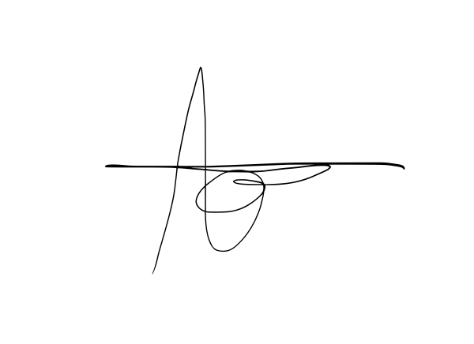

# Deklarasi Penggunaan AI

## Tugas Besar IF2150 - Rekayasa Perangkat Lunak

| Informasi | Keterangan |
|---|---|
| Kelas | K-01 |
| Nomor Kelompok | G-08 |
| Nama Kelompok | firstTimeRPL |
| Nama Perangkat Lunak | *SIGAP* |

**Anggota Kelompok:**

| NIM | Nama |
| --- | --- |
| 13525022 | Muhammad Rafi Insyan Syiham Abrar |
| 13525037 | Muhammad Rafiif Ansyadya |
| 13525076 | Reinhard Mikhael Tandra |
| 13525094 | Arga Cyrano Simanjuntak |
| 13525136 | Jonathan Lewie |

---

### Daftar Isi
* [Milestone 1](#milestone-1)
* Notes: Copy bagian Daftar Isi seperti Milestone 1 untuk Milestone berikutnya, contoh ``* [Milestone 2](#milestone-2)``. Ketika Daftar isi diklik maka akan langsung diarahkan ke bagian bawah sesuai dengan Milestone tujuan.

---

### Log Penggunaan AI per Milestone

Silakan catat penggunaan AI yang berdampak signifikan pada pengerjaan tugas (misal: *generate* fungsi algoritma yang kompleks, *generate* draf dokumen SKPL/DPPL, atau *debugging* error utama). 
*Penggunaan sepele seperti memperbaiki *typo* atau auto-complete satu baris kode tidak perlu dicatat.*

### Milestone 1
| Tool AI | Tujuan Penggunaan | Contoh Prompt Utama | Modifikasi & Validasi Manusia |
| :--- | :--- | :--- | :--- |
| Gemini | Brainstorming topik awal | Tolong berikan topik dan ide awal yang berkaitan dengan SDG 13 | AI menyarankan beberapa contoh topik, namun akhirnya kami memutuskan untuk memilih topik tentang kebakaran hutan karena berkaitan dengan apa yang terjadi akhir-akhir ini |
| Gemini | Brainstorming latar belakang| Apakah indikator data satelit dan tinggi air tanah mungkin dipakai untuk skala tugas besar| AI menyarankan untuk memakai sumber data yang lebih feasible, seperti API gratis dari BMKG. Kami mempertimbangkan untuk memakai saran tersebut dengan verifikasi dan validasi format data dan kebutuhan teknis aplikasi|
| | | | | |

### Milestone 2
| Tool AI | Tujuan Penggunaan | Contoh Prompt Utama | Modifikasi & Validasi Manusia |
| :--- | :--- | :--- | :--- |
| | | | | |
| | | | | |

---
### Pernyataan Integritas dan Persetujuan

Kami yang bertanda tangan di bawah ini menyatakan bahwa seluruh log penggunaan AI di atas adalah benar. Kami telah memvalidasi seluruh hasil AI dan bertanggung jawab penuh atas orisinalitas, keamanan, dan kebenaran hasil akhir dari tugas ini.

| Tanda Tangan | Nama Anggota |
| :---: | :--- |
|  | 13525022 - Muhammad Rafi Insyan Syiham Abrar |
|  | 13525037 - Muhammad Rafiif Ansyadya |
|  | 13525076 - Reinhard Mikhael Tandra |
|  | 13525094 - Arga Cyrano Simanjuntak |
|  | 13525136 - Jonathan Lewie |
