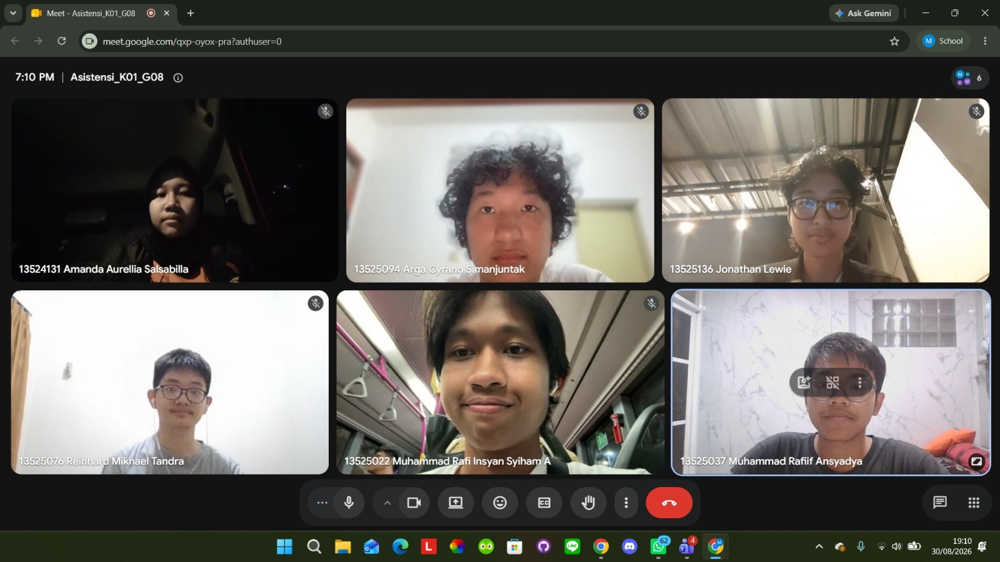

# Form Asistensi

## Tugas Besar IF2150 - Rekayasa Perangkat Lunak

| Informasi | Keterangan |
| --- | --- |
| **Hari** | Minggu |
| **Tanggal** | 30/08/2026 |
| **Kelas** | K-01 |
| **Nomor Kelompok** | G-08  |
| **Nama Kelompok** | firstTimeRPL  |
| **Nama Perangkat Lunak** | SIGAP  |
| **Dokumen** | - |

### Anggota Kelompok

| NIM | Nama |
| --- | --- |
| 13525022 | Muhammad Rafi Insyan Syiham Abrar |
| 13525037 | Muhammad Rafiif Ansyadya |
| 13525076 | Reinhard Mikhael Tandra |
| 13525094 | Arga Cyrano Simanjuntak |
| 13525136 | Jonathan Lewie |

### Catatan

| Catatan |
| --- |
| 1. Jangan lupa draftnya dikerjakan supaya tidak deadliner  |
| 2. Aplikasi tidak perlu digunakan oleh target pengguna sesungguhnya, asalkan kita bisa menempatkan diri sebagai aktor aktornya |
| 3. Untuk pengerjaan milestone 1 sesuai dengan template yang ada di folder M1 |
| 4. Jangan lupa mengisi form asistensi |

## Dokumentasi

<!--  -->

  

  <i>Gambar 1. Dokumentasi kegiatan asistensi.</i>

