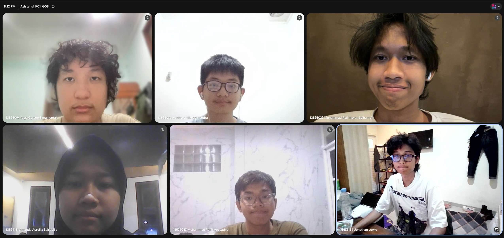

# Form Asistensi

## Tugas Besar IF2150 - Rekayasa Perangkat Lunak

| Informasi | Keterangan |
| --- | --- |
| **Hari** | Selasa |
| **Tanggal** | 08/09/2026 |
| **Kelas** | K-01 |
| **Nomor Kelompok** | G-08  |
| **Nama Kelompok** | firstTimeRPL  |
| **Nama Perangkat Lunak** | SIGAP  |
| **Dokumen** | - |

### Anggota Kelompok

| NIM | Nama |
| --- | --- |
| 13525022 | Muhammad Rafi Insyan Syiham Abrar |
| 13525037 | Muhammad Rafiif Ansyadya |
| 13525076 | Reinhard Mikhael Tandra |
| 13525094 | Arga Cyrano Simanjuntak |
| 13525136 | Jonathan Lewie |

### Catatan

| Catatan |
| --- |
| 1. Yang ada di milestone 1 ke milestone 2 di copas aja, isinya sama persis kalo gak ada perubahan. kalo ada perubahan taro di daftar perubahan dan apa yang diubah  |
| 2. Kebutuhan pengguna awal, deskripsi aktivitas sudah ada |
| 3. Di pemetaan kebutuhan, semua deskripsi aktivitas semuanya dipake. 1 id aktivitas minimal 1 tapi boleh 1 id aktivitas jadi lebih dari 1 id kebutuhan |
| 4. KF dan KNF minimal masing masing 5, secara kumulatif (bukan per ID kebutuhan) |
| 5. 1 KF menggambarkan 1 fitur yang bisa dilakukan perangkat lunak |
| 6. Data wilayah liat dari jurnal atau artikel, gausah turun ke lapangan |

**Notes for this section:**  
*Catatan dapat dituliskan dalam bentuk paragraf atau poin-poin, disesuaikan saja.* 

## Dokumentasi

<!--  -->

  

  <i>Gambar 1. Dokumentasi kegiatan asistensi.</i>

