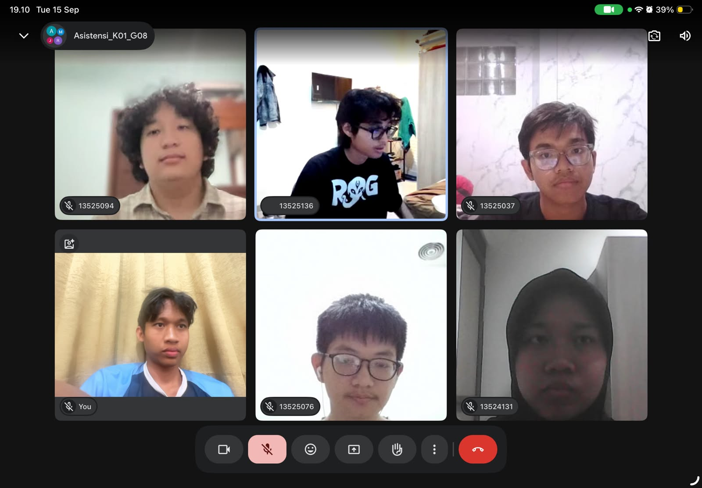

# Form Asistensi

## Tugas Besar IF2150 - Rekayasa Perangkat Lunak

| Informasi | Keterangan |
| --- | --- |
| **Hari** | Selasa |
| **Tanggal** | 15/09/2026 |
| **Kelas** | K-01 |
| **Nomor Kelompok** | G-08  |
| **Nama Kelompok** | firstTimeRPL  |
| **Nama Perangkat Lunak** | SIGAP  |
| **Dokumen** | - |

### Anggota Kelompok

| NIM | Nama |
| --- | --- |
| 13525022 | Muhammad Rafi Insyan Syiham Abrar |
| 13525037 | Muhammad Rafiif Ansyadya |
| 13525076 | Reinhard Mikhael Tandra |
| 13525094 | Arga Cyrano Simanjuntak |
| 13525136 | Jonathan Lewie |

### Catatan

| Catatan |
| --- |
| 1. Semua KF harus terinclude dalam use case  |
| 2. Kalo bisa alternatif skenario ada minimal 1. Misalnya daftar tugas prioritas yang tidak terbuka secara sempurna |
| 3. Include untuk sesuatu yang wajib. contoh ada use case login. Setelah login ada validasi password maka itu include karena berkaitan dan saat login wajib validasi password. Langsung ketrigger |
| 4. Extend untuk sesuatu yang opsional. Seperti saat membayar kita dapat memakai kode promo namun tidak diwajibkan dan bersifat opsional |
| 5. Garis putus putus untuk include exclude extend |
| 6. Garis normal untuk bubble baru |
| 7. Kalo misal ada KF yang mau dikurangi tulis di daftar perubahan |

**Notes for this section:**  
*Catatan dapat dituliskan dalam bentuk paragraf atau poin-poin, disesuaikan saja.* 

## Dokumentasi

<!--  -->

  

  <i>Gambar 1. Dokumentasi kegiatan asistensi.</i>

