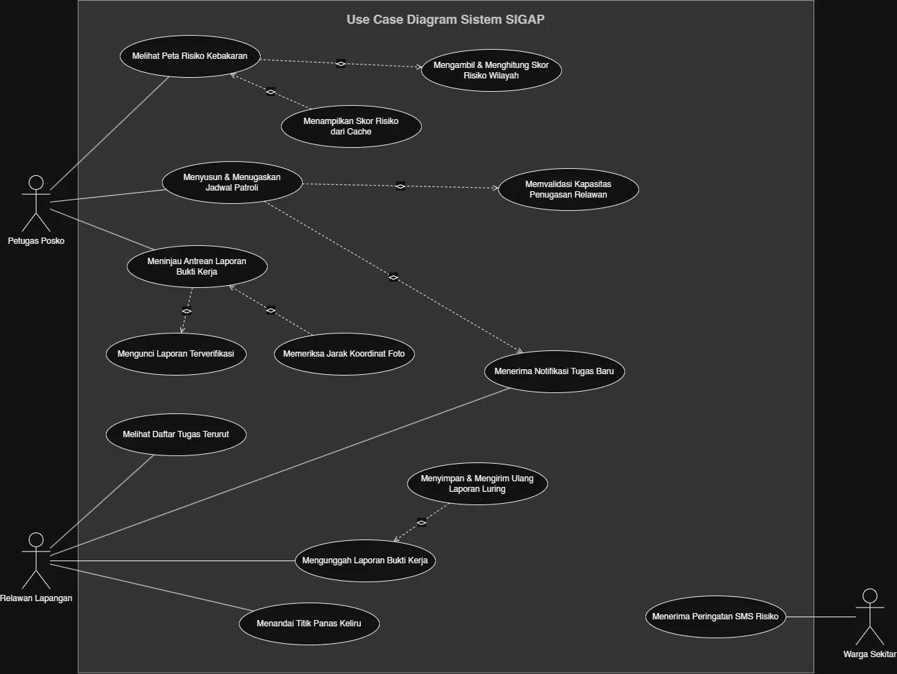

<h1>
IF2150 REKAYASA PERANGKAT LUNAK
 
TUGAS 4
 
CLASS DIAGRAM
</h1>
 

## *SIGAP*

### Untuk: *Amanda Aurellia Salsabilla*

Dipersiapkan oleh:
| Informasi | Keterangan |
| --- | --- |
| Kelas | K-01 |
| Kelompok | G-08  |

| NIM | Nama |
|---|---|
| 13525022 | Muhammad Rafi Insyan Syiham Abrar |
| 13525037 | Muhammad Rafiif Ansyadya |
| 13525076 | Reinhard Mikhael Tandra |
| 13525094 | Arga Cyrano Simanjuntak |
| 13525136 | Jonathan Lewie |
---

## Daftar Perubahan

| Revisi | Deskripsi |
| :--- | :--- |
| A | Dokumen awal Tugas 4. Menyusun Diagram Kelas berdasarkan pola Boundary-Control-Entity (BCE) mengikuti arahan asistensi akbar dengan Kebutuhan Fungsional dan Model Use Case disalin dari dokumen Tugas 2 dan Tugas 3. |

 
 

# BAB 1: Deskripsi Perangkat Lunak

SIGAP adalah sistem informasi berbasis peta untuk mendukung pencegahan kebakaran lahan gambut di satu wilayah percontohan. Dari sudut pandang petugas posko, sistem ini menggantikan cara kerja lama yang mengandalkan pesan WhatsApp berisi koordinat titik panas tanpa konteks. Petugas membuka peta risiko, melihat petak lahan mana yang skornya naik, lalu menyusun jadwal patroli atau perbaikan dan menugaskannya langsung ke relawan yang tersedia lewat sistem.

Dari sudut pandang relawan lapangan, alur kerja dimulai saat menerima notifikasi tugas berisi lokasi dan prioritas. Relawan pergi ke lokasi, mengambil foto dan koordinat sebagai bukti, lalu mengunggahnya. Karena banyak titik gambut bersinyal lemah, unggahan ini harus bisa disiapkan dulu secara luring dan otomatis terkirim begitu sinyal kembali. Relawan juga bisa menandai titik panas yang ternyata bukan kebakaran sungguhan, supaya sistem tidak terus mengulang notifikasi untuk titik yang sama.

Dari sudut pandang warga sekitar lahan gambut, sistem bekerja di belakang layar. Warga tidak membuka aplikasi apa pun sehingga mereka hanya menerima SMS ketika skor risiko di sekitar rumah mereka naik ke ambang tertentu. Nomor HP warga didaftarkan lebih dulu lewat pendataan bersama aparat desa, bukan broadcast ke sembarang nomor, karena pengiriman SMS berbayar dan volumenya harus terkendali sesuai batasan anggaran tim.

Harapan dari penerapan SIGAP bukan menggantikan sistem pemerintah yang sudah ada (SiPongi+, FDRS BMKG), melainkan mengisi celah di lapisan operasional dimana mengubah data mentah titik panas dan cuaca menjadi jadwal kerja dan peringatan yang bisa langsung ditindaklanjuti.

---

# BAB 2: Kebutuhan Fungsional

## 2.1 Kebutuhan Fungsional

Tabel 2.1. Daftar Kebutuhan Fungsional

| ID KF | ID Kebutuhan | Penjelasan |
| :--- | :--- | :--- |
| KF01 | R01 | Perangkat lunak dapat menampilkan peta interaktif dengan petak lahan berwarna sesuai tingkat skor risiko terkini. |
| KF02 | R02 | Perangkat lunak dapat mengambil data titik panas dari FIRMS API dan data cuaca dari BMKG API, lalu menggabungkannya menjadi satu nilai skor per petak lahan. |
| KF03 | R03 | Perangkat lunak dapat membatasi query dan tampilan peta hanya pada koordinat wilayah percontohan yang telah dikonfigurasi. |
| KF04 | R04 | Perangkat lunak dapat menyimpan hasil perhitungan skor risiko terakhir sebagai cache dan menampilkannya jika pengambilan data terbaru gagal. |
| KF05 | R05 | Perangkat lunak dapat menampilkan formulir penyusunan jadwal dan memilih relawan yang akan ditugaskan pada suatu pekerjaan. |
| KF06 | R06 | Perangkat lunak dapat menolak penyimpanan jadwal baru jika jumlah pekerjaan yang belum selesai melebihi jumlah relawan aktif. |
| KF07 | R07 | Perangkat lunak dapat mengirim notifikasi dalam aplikasi ke akun relawan yang mendapat penugasan baru. |
| KF08 | R08 | Perangkat lunak dapat menampilkan antrean laporan bukti kerja beserta tombol setuju/tolak untuk petugas. |
| KF09 | R09 | Perangkat lunak dapat menghitung jarak antara koordinat foto yang diunggah dengan koordinat tugas, dan menampilkan peringatan jika melebihi 200 meter. |
| KF10 | R10 | Perangkat lunak dapat mengunci laporan yang berstatus terverifikasi sehingga field-nya tidak lagi bisa diubah lewat antarmuka relawan. |
| KF11 | R11, R12 | Perangkat lunak dapat menampilkan daftar tugas relawan terurut dari skor risiko tertinggi ke terendah, lengkap dengan lokasi tujuan. |
| KF12 | R13 | Perangkat lunak dapat menyimpan input formulir laporan (foto dan koordinat) ke penyimpanan lokal perangkat ketika tidak ada koneksi internet. |
| KF13 | R14 | Perangkat lunak dapat mencoba mengirim ulang data laporan yang tersimpan di localStorage secara berkala (misalnya tiap koneksi terdeteksi aktif atau saat relawan membuka kembali aplikasi), dengan UUID yang dibuat di sisi klien saat laporan pertama kali diisi sebagai penanda untuk mencegah entri ganda. |
| KF14 | R15 | Perangkat lunak dapat menyediakan tombol "tandai keliru" pada detail titik panas beserta kolom keterangan singkat. |
| KF15 | R16 | Perangkat lunak dapat menyimpan status "keliru" pada suatu titik panas dan menekan pengiriman notifikasi ulang selama 24 jam untuk titik tersebut. |
| KF16 | R17, R18 | Perangkat lunak dapat mengirim SMS ke daftar nomor terdaftar dalam radius tertentu ketika skor risiko petak di sekitarnya melewati ambang yang ditentukan. |

---

# BAB 3: Model Use Case

## 3.1 Identifikasi Aktor

| Aktor | Deskripsi |
| :--- | :--- |
| Petugas Posko | Bertanggung jawab memantau peta risiko, menyusun dan menugaskan jadwal pekerjaan pencegahan, serta memverifikasi laporan bukti kerja relawan. Biasanya bekerja dari satu titik dengan koneksi internet stabil (posko). |
| Relawan Lapangan | Menerima penugasan patroli atau pengecekan titik panas, mengunggah foto dan koordinat sebagai bukti kerja di lokasi. Bekerja berpindah-pindah di area dengan sinyal internet lemah atau tidak ada sama sekali. |
| Warga Sekitar Lahan Gambut | Penerima notifikasi darurat lewat SMS ketika skor risiko di sekitar permukiman meningkat. Tidak login atau membuka antarmuka apa pun, interaksinya satu arah sebagai penerima pesan. |

## 3.2 Identifikasi Use Case

| ID UC | Nama Use Case | Deskripsi Singkat | Aktor Terlibat | ID KF Terkait |
| :--- | :--- | :--- | :--- | :--- |
| UC01 | Memantau Peta Risiko Kebakaran | Petugas melihat peta risiko petak lahan terkini, termasuk kondisi ketika data eksternal tidak tersedia (fallback ke cache). | Petugas Posko | KF01, KF02, KF03, KF04 |
| UC02 | Menyusun dan Menugaskan Jadwal Pencegahan | Petugas menyusun jadwal kerja dan menugaskannya ke relawan aktifnya lalu diikuti oleh sistem menolak jika kapasitas relawan terlampaui dan mengirim notifikasi penugasan. | Petugas Posko | KF05, KF06, KF07 |
| UC03 | Memverifikasi Laporan Bukti Kerja | Petugas meninjau foto dan koordinat bukti kerja relawan, lalu menyetujui atau menolaknya sehingga laporan yang disetujui dikunci. | Petugas Posko | KF08, KF09, KF10 |
| UC04 | Melihat Daftar Tugas Prioritas | Relawan membuka daftar penugasan yang terurut berdasarkan skor risiko. | Relawan Lapangan | KF11 |
| UC05 | Mengunggah Laporan Bukti Kerja | Relawan mengisi dan mengirim laporan foto beserta koordinat, termasuk saat tanpa koneksi internet (tersimpan lokal, terkirim otomatis saat sinyal kembali). | Relawan Lapangan | KF12, KF13 |
| UC06 | Menandai Titik Panas sebagai Deteksi Keliru | Relawan menandai suatu titik panas sebagai false positive disertai keterangan. | Relawan Lapangan | KF14, KF15 |
| UC07 | Menerima Peringatan Dini via SMS | Warga menerima SMS otomatis ketika skor risiko di sekitar permukiman melewati ambang. | Warga Sekitar Lahan Gambut | KF16 |

## 3.3 Use Case Diagram

 

<i>Gambar 1. Use Case Diagram sistem SIGAP</i>

 

## 3.4 Skenario Use Case

### 3.4.1 Skenario UC01

**Nama Use Case:** Memantau Peta Risiko Kebakaran

**Skenario Normal**

| No | Aksi Aktor | Reaksi Perangkat Lunak |
| :--- | :--- | :--- |
| 1 | Petugas posko membuka menu peta risiko | Sistem mengambil data titik panas dari FIRMS API dan data cuaca dari BMKG API, membatasi cakupan pada koordinat wilayah percontohan yang telah dikonfigurasi |
| 2 | - | Sistem menggabungkan data titik panas dan cuaca menjadi satu nilai skor risiko per petak lahan, lalu menyimpannya sebagai cache terbaru |
| 3 | - | Sistem menampilkan peta interaktif dengan petak lahan berwarna sesuai tingkat skor risiko terkini |

**Skenario Alternatif 1: Pengambilan data eksternal gagal**

| No | Aksi Aktor | Reaksi Perangkat Lunak |
| :--- | :--- | :--- |
| 1 | Petugas posko membuka menu peta risiko | Sistem mencoba mengambil data dari API, namun gagal |
| 2 | - | Sistem mendeteksi kegagalan tersebut dan mengambil hasil perhitungan skor risiko terakhir dari cache |
| 3 | - | Sistem menampilkan peta menggunakan data cache disertai keterangan bahwa data yang ditampilkan bukan data terkini |

### 3.4.2 Skenario UC02

**Nama Use Case:** Menyusun dan Menugaskan Jadwal Pencegahan

**Skenario Normal**

| No | Aksi Aktor | Reaksi Perangkat Lunak |
| :--- | :--- | :--- |
| 1 | Petugas posko membuka menu penyusunan jadwal | Sistem menampilkan formulir penyusunan jadwal beserta daftar relawan yang berstatus aktif |
| 2 | Petugas posko mengisi detail pekerjaan dan memilih relawan yang akan ditugaskan | Sistem memvalidasi bahwa jumlah pekerjaan yang belum selesai masih di bawah jumlah relawan aktif |
| 3 | Petugas posko menekan tombol simpan jadwal | Sistem menyimpan jadwal baru dan mengirim notifikasi ke akun relawan yang mendapat penugasan tersebut |

**Skenario Alternatif 1: Kapasitas relawan terlampaui**

| No | Aksi Aktor | Reaksi Perangkat Lunak |
| :--- | :--- | :--- |
| 1 | Petugas posko membuka menu penyusunan jadwal | Sistem menampilkan formulir penyusunan jadwal beserta daftar relawan yang berstatus aktif |
| 2 | Petugas posko mengisi detail pekerjaan dan memilih relawan, lalu menekan tombol simpan jadwal | Sistem mendeteksi bahwa jumlah pekerjaan yang belum selesai melebihi jumlah relawan aktif, lalu menolak penyimpanan jadwal dan menampilkan pesan bahwa kapasitas relawan telah terlampaui |
| 3 | Petugas posko mengurangi jumlah pekerjaan atau menunggu relawan tersedia, lalu mencoba menyimpan kembali | Sistem memproses ulang sesuai skenario normal langkah 2–3 |

### 3.4.3 Skenario UC03

**Nama Use Case:** Memverifikasi Laporan Bukti Kerja

**Skenario Normal**

| No | Aksi Aktor | Reaksi Perangkat Lunak |
| :--- | :--- | :--- |
| 1 | Petugas posko membuka menu antrean laporan bukti kerja | Sistem menampilkan daftar laporan berstatus "menunggu verifikasi" beserta nama relawan dan waktu unggah |
| 2 | Petugas posko memilih salah satu laporan pada antrean | Sistem menampilkan detail laporan (foto, koordinat unggahan, koordinat tugas, dan hasil perhitungan jarak antar keduanya) beserta tombol setuju dan tolak |
| 3 | Petugas posko menekan tombol setuju | Sistem mengubah status laporan menjadi "terverifikasi", mengunci seluruh field laporan agar tidak dapat diubah lewat antarmuka relawan, dan mengembalikan tampilan ke antrean laporan |

**Skenario Alternatif 1: Jarak koordinat foto melebihi 200 meter**

| No | Aksi Aktor | Reaksi Perangkat Lunak |
| :--- | :--- | :--- |
| 1 | Petugas posko membuka menu antrean laporan bukti kerja | Sistem menampilkan daftar laporan berstatus "menunggu verifikasi" beserta nama relawan dan waktu unggah |
| 2 | Petugas posko memilih salah satu laporan pada antrean | Sistem menghitung jarak koordinat foto terhadap koordinat tugas, mendeteksi jarak melebihi 200 meter, lalu menampilkan detail laporan disertai peringatan bahwa lokasi bukti kerja berada di luar radius wajar |
| 3 | Petugas posko meninjau peringatan lalu menekan tombol setuju atau tolak | Sistem memproses keputusan petugas sesuai skenario normal langkah 3 (jika setuju) atau skenario alternatif 2 (jika tolak) |

**Skenario Alternatif 2: Petugas menolak laporan**

| No | Aksi Aktor | Reaksi Perangkat Lunak |
| :--- | :--- | :--- |
| 1 | Petugas posko membuka menu antrean laporan bukti kerja | Sistem menampilkan daftar laporan berstatus "menunggu verifikasi" beserta nama relawan dan waktu unggah |
| 2 | Petugas posko memilih salah satu laporan pada antrean | Sistem menampilkan detail laporan beserta tombol setuju dan tolak |
| 3 | Petugas posko menekan tombol tolak dan mengisi alasan penolakan | Sistem mengubah status laporan menjadi "ditolak", menyimpan alasan penolakan, dan mengirim notifikasi ke relawan terkait agar dapat mengunggah ulang bukti kerja |

**Skenario Alternatif 3: Tidak ada laporan pada antrean**

| No | Aksi Aktor | Reaksi Perangkat Lunak |
| :--- | :--- | :--- |
| 1 | Petugas posko membuka menu antrean laporan bukti kerja | Sistem mendeteksi tidak ada laporan berstatus "menunggu verifikasi" dan menampilkan pesan bahwa antrean laporan sedang kosong |

### 3.4.4 Skenario UC04

**Nama Use Case:** Melihat Daftar Tugas Prioritas

**Skenario Normal**

| No | Aksi Aktor | Reaksi Perangkat Lunak |
| :--- | :--- | :--- |
| 1 | Relawan lapangan membuka menu daftar tugas | Sistem menampilkan seluruh tugas yang ditugaskan kepada relawan tersebut, terurut dari skor risiko tertinggi ke terendah, lengkap dengan lokasi tujuan dan status tugas |
| 2 | Relawan lapangan memilih salah satu tugas pada daftar | Sistem menampilkan detail tugas berupa koordinat lokasi tujuan, skor risiko petak, dan jenis pekerjaan yang harus dilakukan |

*Catatan: UC04 tidak memiliki skenario alternatif karena alurnya murni menampilkan data tanpa titik percabangan.*

### 3.4.5 Skenario UC05

**Nama Use Case:** Mengunggah Laporan Bukti Kerja

**Skenario Normal**

| No | Aksi Aktor | Reaksi Perangkat Lunak |
| :--- | :--- | :--- |
| 1 | Relawan memilih menu membuat laporan | Sistem memunculkan tampilan agar relawan dapat mengisi laporan dan GPS device langsung dipakai untuk mengisi koordinat |
| 2 | Relawan mengambil foto kondisi lapangan | Sistem menyimpan foto yang telah diambil oleh relawan |
| 3 | Relawan menekan tombol kirim laporan | Sistem mengirim laporan yang sudah diisi untuk dapat diverifikasi oleh petugas posko |

**Skenario Alternatif 1: Device tidak ada koneksi internet**

| No | Aksi Aktor | Reaksi Perangkat Lunak |
| :--- | :--- | :--- |
| 1 | Relawan memilih menu membuat laporan | Sistem memunculkan tampilan agar relawan dapat mengisi laporan dan GPS langsung dipakai untuk mengisi koordinat |
| 2 | Relawan mengambil foto kondisi lapangan | Sistem menyimpan foto yang telah diambil oleh relawan |
| 3 | Relawan menekan tombol kirim laporan | Sistem mendeteksi bahwa device tidak terkoneksi internet sehingga laporan disimpan secara lokal terlebih dahulu |
| 4 | Relawan mengkoneksikan device ke internet | Sistem akan secara otomatis mengirim laporan yang ada di lokal untuk diverifikasi oleh petugas posko |

**Skenario Alternatif 2: GPS device belum dinyalakan**

| No | Aksi Aktor | Reaksi Perangkat Lunak |
| :--- | :--- | :--- |
| 1 | Relawan memilih menu membuat laporan | Sistem mendeteksi bahwa GPS belum dinyalakan sehingga muncul pesan peringatan agar pengguna dapat menyalakan GPS |
| 2 | Relawan menyalakan GPS device | Sistem mendeteksi bahwa GPS sudah dinyalakan sehingga koordinat dapat langsung diisi |
| 3 | Relawan mengambil foto kondisi lapangan | Kembali ke skenario normal 2 |

### 3.4.6 Skenario UC06

**Nama Use Case:** Menandai Titik Panas sebagai Deteksi Keliru

**Skenario Normal**

| No | Aksi Aktor | Reaksi Perangkat Lunak |
| :--- | :--- | :--- |
| 1 | Relawan menekan tombol deteksi keliru pada suatu titik panas | Sistem memunculkan menu supaya relawan dapat mengisi kolom keterangan singkat |
| 2 | Relawan mengisi keterangan dan menekan tombol kirim | Sistem mengubah status titik panas tersebut sebagai deteksi keliru dengan keterangan yang telah diisi |

**Skenario Alternatif 1: Relawan tidak mengisi kolom keterangan**

| No | Aksi Aktor | Reaksi Perangkat Lunak |
| :--- | :--- | :--- |
| 1 | Relawan menekan tombol deteksi keliru pada suatu titik panas | Sistem memunculkan menu supaya relawan dapat mengisi kolom keterangan singkat |
| 2 | Relawan tidak mengisi keterangan dan langsung menekan tombol kirim | Sistem memunculkan peringatan bahwa keterangan belum diisi |
| 3 | Relawan mengisi keterangan | Kembali ke skenario normal 2 |

**Skenario Alternatif 2: Tidak ada koneksi internet pada device**

| No | Aksi Aktor | Reaksi Perangkat Lunak |
| :--- | :--- | :--- |
| 1 | Relawan menekan tombol deteksi keliru pada suatu titik panas | Sistem memunculkan menu supaya relawan dapat mengisi kolom keterangan singkat |
| 2 | Relawan mengisi keterangan dan menekan tombol kirim | Sistem memunculkan peringatan bahwa device tidak memiliki koneksi internet dan menyimpan laporan tentang deteksi keliru secara lokal terlebih dahulu |
| 3 | Relawan mengkoneksikan device ke internet | Sistem akan secara otomatis mengirim laporan deteksi keliru yang ada di lokal supaya status titik panasnya dapat diubah |

### 3.4.7 Skenario UC07

**Nama Use Case:** Menerima Peringatan Dini via SMS

**Skenario Normal**

| No | Aksi Aktor | Reaksi Perangkat Lunak |
| :--- | :--- | :--- |
| 1 | Warga berada di area terdaftar yang petak lahannya melewati ambang batas skor risiko | Sistem mendeteksi skor risiko kebakaran di sekitar area permukiman warga telah melewati ambang batas aman |
| 2 | - | Sistem mengidentifikasi daftar nomor telepon warga di wilayah terdampak yang terdaftar pada sistem |
| 3 | - | Sistem secara otomatis mengirimkan pesan SMS peringatan dini kebakaran ke nomor telepon warga melalui gateway SMS |
| 4 | Warga menerima dan membuka SMS peringatan dini pada perangkat telepon genggam | - |

**Skenario Alternatif 1: Nomor telepon warga tidak aktif atau di luar jangkauan sinyal operator**

| No | Aksi Aktor | Reaksi Perangkat Lunak |
| :--- | :--- | :--- |
| 1 | Warga berada di area terdaftar, tetapi perangkat seluler mati atau berada di luar jangkauan sinyal operator | Sistem mendeteksi skor risiko kebakaran di sekitar area permukiman warga telah melewati ambang batas aman |
| 2 | - | Sistem mengidentifikasi daftar nomor telepon warga di wilayah terdampak |
| 3 | - | Sistem mengirimkan SMS peringatan dini via gateway SMS, tetapi gagal mengirim karena nomor tidak aktif atau di luar jangkauan |
| 4 | - | Sistem menjadwalkan pengiriman ulang secara berkala sampai batas percobaan maksimum, lalu mencatat log kegagalan jika tetap tidak terkirim |
| 5 | Warga menerima dan membuka SMS peringatan dini pada perangkat telepon genggam | - |

**Skenario Alternatif 2: Terjadi gangguan pada gateway penyedia layanan SMS**

| No | Aksi Aktor | Reaksi Perangkat Lunak |
| :--- | :--- | :--- |
| 1 | Warga berada di area terdaftar yang petak lahannya melewati ambang batas skor risiko | Sistem mendeteksi skor risiko kebakaran di sekitar area permukiman warga telah melewati ambang batas aman |
| 2 | - | Sistem mencoba menghubungkan dan mengirim antrean SMS melalui gateway SMS utama |
| 3 | - | Gateway SMS mengalami kendala koneksi/layanan |
| 4 | - | Sistem secara otomatis mengalihkan pengiriman ke gateway cadangan dan mengirimkan pesan ke warga |
| 5 | Warga menerima dan membuka SMS peringatan dini pada perangkat telepon genggam | - |

---

# BAB 4: Diagram Kelas

Diagram kelas SIGAP disusun mengikuti pola **Boundary-Control-Entity (BCE)**: kelas *boundary* merepresentasikan antarmuka yang dilihat pengguna (sisi klien), kelas *control* menjalankan logika bisnis dan menjadi perantara ke data (sisi server/service), dan kelas *entity* menyimpan data yang bertahan (business data). Notasi UML dipilih sesuai kebutuhan nyata dari skenario, bukan dipaksakan agar semua jenis relasi muncul.

## 4.1 Identifikasi Kelas

| ID Kelas | Nama Kelas | Tipe | Deskripsi Kelas | ID Use Case |
| :--- | :--- | :--- | :--- | :--- |
| C01 | `HalamanPetaRisiko` | Boundary | Antarmuka peta risiko yang dilihat petugas posko. | UC01 |
| C02 | `PetaRisikoController` | Control | Mengambil data FIRMS/BMKG, menghitung skor risiko, dan menangani fallback ke cache. | UC01 |
| C03 | `PetakLahan` | Entity | Menyimpan koordinat, skor risiko, dan waktu pembaruan terakhir suatu petak lahan. | UC01, UC07 |
| C04 | `TitikPanas` | Entity | Menyimpan data mentah titik panas: koordinat, waktu deteksi, dan status validitas. | UC01, UC06 |
| C05 | `FormPenyusunanJadwal` | Boundary | Antarmuka penyusunan jadwal dan pemilihan relawan oleh petugas posko. | UC02 |
| C06 | `JadwalController` | Control | Memvalidasi kapasitas relawan, membuat jadwal, dan memicu notifikasi penugasan. | UC02 |
| C07 | `JadwalPekerjaan` | Entity | Menyimpan detail satu pekerjaan pencegahan: jenis, prioritas, status, dan tanggal. | UC02, UC03, UC04 |
| C08 | `RelawanLapangan` | Entity | Menyimpan data relawan: identitas, kontak, dan status keaktifan. | UC02 |
| C09 | `HalamanAntreanLaporan` | Boundary | Antarmuka antrean laporan bukti kerja untuk petugas posko. | UC03 |
| C10 | `VerifikasiLaporanController` | Control | Menghitung jarak GPS, memproses persetujuan/penolakan, dan mengunci laporan terverifikasi. | UC03 |
| C11 | `LaporanBuktiKerja` | Entity | Menyimpan foto, koordinat unggahan, jarak ke lokasi tugas, dan status verifikasi. | UC03, UC05 |
| C12 | `HalamanDaftarTugas` | Boundary | Antarmuka daftar tugas relawan, terurut berdasarkan prioritas risiko. | UC04 |
| C13 | `DaftarTugasController` | Control | Mengambil dan mengurutkan tugas milik relawan yang sedang login. | UC04 |
| C14 | `FormLaporanBuktiKerja` | Boundary | Antarmuka pengisian laporan bukti kerja relawan (foto, koordinat). | UC05 |
| C15 | `UploadLaporanController` | Control | Mendeteksi status koneksi, menyimpan laporan secara lokal, dan menyinkronkannya saat koneksi tersedia. | UC05 |
| C16 | `DialogTandaiKeliru` | Boundary | Antarmuka penandaan titik panas sebagai deteksi keliru. | UC06 |
| C17 | `DeteksiKeliruController` | Control | Memvalidasi keterangan, mengubah status titik panas, dan menekan notifikasi ulang selama 24 jam. | UC06 |
| C18 | `PeringatanSMSController` | Control | Mengecek ambang risiko, mengidentifikasi warga terdampak, mengirim SMS, dan menangani retry/gateway cadangan. | UC07 |
| C19 | `Warga` | Entity | Menyimpan nomor HP terdaftar dan wilayah tempat tinggal warga. | UC07 |
| C20 | `PeringatanSMS` | Entity | Log pengiriman SMS: waktu kirim dan status (terkirim/gagal). | UC07 |

## 4.2 Diagram Kelas per Use Case

### 4.2.1 Use Case UC01

**Nama Use Case:** *Memantau Peta Risiko Kebakaran*

#### Identifikasi Kelas

| ID Kelas | Nama Kelas | Deskripsi Kelas |
| :--- | :--- | :--- |
| C01 | `HalamanPetaRisiko` | Antarmuka peta risiko yang dilihat petugas posko. |
| C02 | `PetaRisikoController` | Mengambil data FIRMS/BMKG, menghitung skor risiko, dan menangani fallback ke cache. |
| C03 | `PetakLahan` | Menyimpan koordinat, skor risiko, dan waktu pembaruan terakhir suatu petak lahan. |
| C04 | `TitikPanas` | Menyimpan data mentah titik panas: koordinat, waktu deteksi, dan status validitas. |

#### Diagram Kelas

 

<i>Gambar 2. Use Case UC01 Diagram</i>

 

| ID Kelas | Nama Kelas | Atribut | Metode/Operasi |
| :--- | :--- | :--- | :--- |
| C01 | `HalamanPetaRisiko` | - | `tampilkanPeta()`, `tampilkanKeteranganCache()` |
| C02 | `PetaRisikoController` | - | `ambilDataFIRMS()`, `ambilDataBMKG()`, `hitungSkorRisiko()`, `ambilDataCache()` |
| C03 | `PetakLahan` | `koordinat`, `skorRisiko`, `waktuUpdateTerakhir` | `perbaruiSkor()`, `simpanCache()` |
| C04 | `TitikPanas` | `koordinat`, `waktuDeteksi`, `statusValiditas` | `getStatus()` |

Relasi: `PetakLahan` **agregasi** ke `TitikPanas`, satu titik panas tetap punya arti sebagai data mentah dari FIRMS walau petak lahannya belum/tidak terhitung skornya.

### 4.2.2 Use Case UC02

**Nama Use Case:** *Menyusun dan Menugaskan Jadwal Pencegahan*

#### Identifikasi Kelas

| ID Kelas | Nama Kelas | Deskripsi Kelas |
| :--- | :--- | :--- |
| C05 | `FormPenyusunanJadwal` | Antarmuka penyusunan jadwal dan pemilihan relawan oleh petugas posko. |
| C06 | `JadwalController` | Memvalidasi kapasitas relawan, membuat jadwal, dan memicu notifikasi penugasan. |
| C07 | `JadwalPekerjaan` | Menyimpan detail satu pekerjaan pencegahan: jenis, prioritas, status, dan tanggal. |
| C08 | `RelawanLapangan` | Menyimpan data relawan: identitas, kontak, dan status keaktifan. |

#### Diagram Kelas

 

<i>Gambar 3. Use Case UC02 Diagram</i>

 

| ID Kelas | Nama Kelas | Atribut | Metode/Operasi |
| :--- | :--- | :--- | :--- |
| C05 | `FormPenyusunanJadwal` | - | `tampilkanForm()`, `tampilkanDaftarRelawanAktif()`, `tampilkanPesanKapasitasPenuh()` |
| C06 | `JadwalController` | - | `validasiKapasitas()`, `buatJadwal()`, `kirimNotifikasiTugas()` |
| C07 | `JadwalPekerjaan` | `jenisPekerjaan`, `prioritas`, `status`, `tanggal` | `perbaruiStatus()` |
| C08 | `RelawanLapangan` | `nama`, `kontak`, `statusAktif` | `getStatusAktif()` |

Relasi: `JadwalController` bergantung (**dependency**) pada `RelawanLapangan` hanya untuk mengecek jumlah relawan aktif sesaat saat validasi dimana tidak menyimpannya sebagai state permanen controller. `JadwalPekerjaan` **asosiasi** ke `RelawanLapangan` karena satu jadwal memang ditugaskan secara tetap ke satu relawan.

### 4.2.3 Use Case UC03

**Nama Use Case:** *Memverifikasi Laporan Bukti Kerja*

#### Identifikasi Kelas

| ID Kelas | Nama Kelas | Deskripsi Kelas |
| :--- | :--- | :--- |
| C09 | `HalamanAntreanLaporan` | Antarmuka antrean laporan bukti kerja untuk petugas posko. |
| C10 | `VerifikasiLaporanController` | Menghitung jarak GPS, memproses persetujuan/penolakan, dan mengunci laporan terverifikasi. |
| C11 | `LaporanBuktiKerja` | Menyimpan foto, koordinat unggahan, jarak ke lokasi tugas, dan status verifikasi. |

#### Diagram Kelas

 

<i>Gambar 4. Use Case UC03 Diagram</i>

 

| ID Kelas | Nama Kelas | Atribut | Metode/Operasi |
| :--- | :--- | :--- | :--- |
| C09 | `HalamanAntreanLaporan` | - | `tampilkanAntrean()`, `tampilkanDetailLaporan()`, `tampilkanPeringatanJarak()` |
| C10 | `VerifikasiLaporanController` | - | `hitungJarak()`, `verifikasiLaporan()`, `tolakLaporan()`, `kunciLaporan()` |
| C11 | `LaporanBuktiKerja` | `foto`, `koordinatUnggah`, `waktuUnggah`, `jarakKeTugas`, `status`, `alasanPenolakan` | `getStatus()` |

Relasi: `LaporanBuktiKerja` **asosiasi** ke `JadwalPekerjaan` dimana satu laporan merujuk ke satu tugas tertentu.

### 4.2.4 Use Case UC04
**Nama Use Case:** *Melihat Daftar Tugas Prioritas*

#### Identifikasi Kelas

| ID Kelas | Nama Kelas | Deskripsi Kelas |
| :--- | :--- | :--- |
| C12 | `HalamanDaftarTugas` | Antarmuka daftar tugas relawan, terurut berdasarkan prioritas risiko. |
| C13 | `DaftarTugasController` | Mengambil dan mengurutkan tugas milik relawan yang sedang login. |
| C07 | `JadwalPekerjaan` | Menyimpan detail pekerjaan pencegahan yang ditugaskan kepada relawan. |

#### Diagram Kelas

 

<i>Gambar 5. Use Case UC04 Diagram</i>

 

| ID Kelas | Nama Kelas | Atribut | Metode/Operasi |
| :--- | :--- | :--- | :--- |
| C12 | `HalamanDaftarTugas` | - | `tampilkanDaftarTugas()`, `tampilkanDetailTugas()` |
| C13 | `DaftarTugasController` | - | `ambilTugasRelawan()`, `urutkanBerdasarkanPrioritas()` |
| C07 | `JadwalPekerjaan` | `jenisPekerjaan`, `prioritas`, `status`, `tanggal` | - |

### 4.2.5 Use Case UC05

**Nama Use Case:** *Mengunggah Laporan Bukti Kerja*

#### Identifikasi Kelas

| ID Kelas | Nama Kelas | Deskripsi Kelas |
| :--- | :--- | :--- |
| C14 | `FormLaporanBuktiKerja` | Antarmuka pengisian laporan bukti kerja relawan. |
| C15 | `UploadLaporanController` | Mendeteksi koneksi, menyimpan laporan secara lokal, dan menyinkronkannya. |
| C11 | `LaporanBuktiKerja` | Menyimpan foto, koordinat unggahan, dan waktu unggah. |

#### Diagram Kelas

 

<i>Gambar 6. Use Case UC05 Diagram</i>

 

| ID Kelas | Nama Kelas | Atribut | Metode/Operasi |
| :--- | :--- | :--- | :--- |
| C14 | `FormLaporanBuktiKerja` | - | `tampilkanForm()`, `ambilFoto()`, `ambilKoordinatGPS()` |
| C15 | `UploadLaporanController` | - | `deteksiKoneksi()`, `simpanLokal()`, `sinkronOtomatis()`, `generateUUID()` |
| C11 | `LaporanBuktiKerja` | `foto`, `koordinatUnggah`, `waktuUnggah` | - |

### 4.2.6 Use Case UC06

**Nama Use Case:** *Menandai Titik Panas sebagai Deteksi Keliru*

#### Identifikasi Kelas

| ID Kelas | Nama Kelas | Deskripsi Kelas |
| :--- | :--- | :--- |
| C16 | `DialogTandaiKeliru` | Antarmuka penandaan titik panas sebagai deteksi keliru. |
| C17 | `DeteksiKeliruController` | Memvalidasi keterangan, mengubah status titik panas, dan menekan notifikasi ulang. |
| C04 | `TitikPanas` | Menyimpan keterangan dan waktu penandaan deteksi keliru. |

#### Diagram Kelas

 

<i>Gambar 7. Use Case UC06 Diagram</i>

 

| ID Kelas | Nama Kelas | Atribut | Metode/Operasi |
| :--- | :--- | :--- | :--- |
| C16 | `DialogTandaiKeliru` | - | `tampilkanForm()`, `tampilkanPeringatanKeteranganKosong()` |
| C17 | `DeteksiKeliruController` | - | `validasiKeterangan()`, `ubahStatusTitikPanas()`, `tekanNotifikasiUlang()` |
| C04 | `TitikPanas` | `keterangan`, `waktuTandaiKeliru` | - |

### 4.2.7 Use Case UC07

**Nama Use Case:** *Menerima Peringatan Dini via SMS*

#### Identifikasi Kelas

| ID Kelas | Nama Kelas | Deskripsi Kelas |
| :--- | :--- | :--- |
| C18 | `PeringatanSMSController` | Mengecek ambang risiko, mengidentifikasi warga terdampak, dan mengirim SMS. |
| C19 | `Warga` | Menyimpan nomor HP terdaftar dan wilayah tempat tinggal warga. |
| C20 | `PeringatanSMS` | Menyimpan log pengiriman SMS, waktu kirim, dan statusnya. |

#### Diagram Kelas

 

<i>Gambar 8. Use Case UC07 Diagram</i>

 

| ID Kelas | Nama Kelas | Atribut | Metode/Operasi |
| :--- | :--- | :--- | :--- |
| C18 | `PeringatanSMSController` | - | `cekAmbangRisiko()`, `identifikasiWargaTerdampak()`, `kirimSMS()`, `jadwalkanUlang()`, `alihkanGatewayCadangan()` |
| C19 | `Warga` | `nomorHP`, `wilayah` | - |
| C20 | `PeringatanSMS` | `waktuKirim`, `status` | - |

Relasi: `PeringatanSMSController` bergantung (**dependency**) pada `PetakLahan` hanya untuk membaca skor risiko sesaat, **asosiasi** ke `Warga` dan `PeringatanSMS` karena keduanya dikelola dan dicatat langsung oleh controller ini.

## 4.3 Diagram Kelas Keseluruhan

 

<i>Gambar 9. Diagram Kelas Keseluruhan</i>

 

| ID Kelas | Nama Kelas | Tipe | Atribut | Metode/Operasi |
| :--- | :--- | :--- | :--- | :--- |
| C01 | `HalamanPetaRisiko` | Boundary | - | `tampilkanPeta()`, `tampilkanKeteranganCache()` |
| C02 | `PetaRisikoController` | Control | - | `ambilDataFIRMS()`, `ambilDataBMKG()`, `hitungSkorRisiko()`, `ambilDataCache()` |
| C03 | `PetakLahan` | Entity | `koordinat`, `skorRisiko`, `waktuUpdateTerakhir` | `perbaruiSkor()`, `simpanCache()` |
| C04 | `TitikPanas` | Entity | `koordinat`, `waktuDeteksi`, `statusValiditas`, `keterangan`, `waktuTandaiKeliru` | `getStatus()` |
| C05 | `FormPenyusunanJadwal` | Boundary | - | `tampilkanForm()`, `tampilkanDaftarRelawanAktif()`, `tampilkanPesanKapasitasPenuh()` |
| C06 | `JadwalController` | Control | - | `validasiKapasitas()`, `buatJadwal()`, `kirimNotifikasiTugas()` |
| C07 | `JadwalPekerjaan` | Entity | `jenisPekerjaan`, `prioritas`, `status`, `tanggal` | `perbaruiStatus()` |
| C08 | `RelawanLapangan` | Entity | `nama`, `kontak`, `statusAktif` | `getStatusAktif()` |
| C09 | `HalamanAntreanLaporan` | Boundary | - | `tampilkanAntrean()`, `tampilkanDetailLaporan()`, `tampilkanPeringatanJarak()` |
| C10 | `VerifikasiLaporanController` | Control | - | `hitungJarak()`, `verifikasiLaporan()`, `tolakLaporan()`, `kunciLaporan()` |
| C11 | `LaporanBuktiKerja` | Entity | `foto`, `koordinatUnggah`, `waktuUnggah`, `jarakKeTugas`, `status`, `alasanPenolakan` | `getStatus()` |
| C12 | `HalamanDaftarTugas` | Boundary | - | `tampilkanDaftarTugas()`, `tampilkanDetailTugas()` |
| C13 | `DaftarTugasController` | Control | - | `ambilTugasRelawan()`, `urutkanBerdasarkanPrioritas()` |
| C14 | `FormLaporanBuktiKerja` | Boundary | - | `tampilkanForm()`, `ambilFoto()`, `ambilKoordinatGPS()` |
| C15 | `UploadLaporanController` | Control | - | `deteksiKoneksi()`, `simpanLokal()`, `sinkronOtomatis()`, `generateUUID()` |
| C16 | `DialogTandaiKeliru` | Boundary | - | `tampilkanForm()`, `tampilkanPeringatanKeteranganKosong()` |
| C17 | `DeteksiKeliruController` | Control | - | `validasiKeterangan()`, `ubahStatusTitikPanas()`, `tekanNotifikasiUlang()` |
| C18 | `PeringatanSMSController` | Control | - | `cekAmbangRisiko()`, `identifikasiWargaTerdampak()`, `kirimSMS()`, `jadwalkanUlang()`, `alihkanGatewayCadangan()` |
| C19 | `Warga` | Entity | `nomorHP`, `wilayah` | - |
| C20 | `PeringatanSMS` | Entity | `waktuKirim`, `status` | - |

---

# BAB 5: Traceability

| ID Kelas | ID Use Case | ID KF |
| :--- | :--- | :--- |
| C01 | UC01 | KF01, KF04 |
| C02 | UC01 | KF01, KF02, KF03, KF04 |
| C03 | UC01, UC07 | KF01, KF02, KF04, KF16 |
| C04 | UC01, UC06 | KF01, KF14, KF15 |
| C05 | UC02 | KF05 |
| C06 | UC02 | KF05, KF06, KF07 |
| C07 | UC02, UC03, UC04 | KF05, KF06, KF08, KF11 |
| C08 | UC02 | KF05, KF06 |
| C09 | UC03 | KF08 |
| C10 | UC03 | KF08, KF09, KF10 |
| C11 | UC03, UC05 | KF08, KF09, KF10, KF12, KF13 |
| C12 | UC04 | KF11 |
| C13 | UC04 | KF11 |
| C14 | UC05 | KF12 |
| C15 | UC05 | KF12, KF13 |
| C16 | UC06 | KF14 |
| C17 | UC06 | KF14, KF15 |
| C18 | UC07 | KF16 |
| C19 | UC07 | KF16 |
| C20 | UC07 | KF16 |

---

# Referensi

- https://firms.modaps.eosdis.nasa.gov/api/ (NASA FIRMS API, MAP_KEY, rate limit 100 request/60 detik)
- https://github.com/infoBMKG/data-cuaca (BMKG JSON API)
- Undang-Undang Republik Indonesia Nomor 27 Tahun 2022 tentang Pelindungan Data Pribadi
- Peraturan Pemerintah Republik Indonesia Nomor 71 Tahun 2014 tentang Perlindungan dan Pengelolaan Ekosistem Gambut
- Diagram UML: https://www.drawio.com/, https://staruml.io/