<h1>
IF2150 REKAYASA PERANGKAT LUNAK
<br>
TUGAS 5
<br>
SPESIFIKASI KEBUTUHAN PERANGKAT LUNAK (SKPL)
</h1>
<br>

## *SIGAP*

### Untuk: *Amanda Aurellia Salsabilla*

Dipersiapkan oleh:
| Informasi | Keterangan |
| --- | --- |
| Kelas | K-01 |
| Kelompok | G-08 |

| NIM | Nama |
|---|---|
| 13525022 | Muhammad Rafi Insyan Syiham Abrar |
| 13525037 | Muhammad Rafiif Ansyadya |
| 13525076 | Reinhard Mikhael Tandra |
| 13525094 | Arga Cyrano Simanjuntak |
| 13525136 | Jonathan Lewie |
---

## Daftar Perubahan

| Revisi | Deskripsi |
| :--- | :--- |
| A | Dokumen awal SKPL, gabungan dari dokumen Topic Brainstorming, Requirement Gathering, Use Case, dan Class Diagram. |
| B | KF01 sampai KF16 ditulis ulang dalam format EARS. Pada dokumen Tugas 2 sampai Tugas 4, KF masih memakai pola "Perangkat lunak dapat ...". |
| C | Sumber data cuaca pada R02, KF02, dan C02 diganti dari API BMKG ke Open-Meteo. Indeks kekeringan pada rumus skor membutuhkan curah hujan beberapa hari ke belakang, sedangkan API prakiraan BMKG hanya menyediakan prakiraan 3 hari ke depan. Metode `ambilDataBMKG()` pada C02 diganti menjadi `ambilDataCuaca()`. Batas pemakaian NASA FIRMS juga dikoreksi dari "100 request per 60 detik" menjadi 5000 transaksi per 10 menit per MAP_KEY sesuai dokumentasi FIRMS. |
| D | KF02 diperjelas: perhitungan ulang skor dijalankan oleh penjadwal setiap 3 jam, dan saat petugas membuka peta sistem langsung menampilkan hasil perhitungan yang sudah tersimpan. Pada Tugas 3 dan Tugas 4, pengambilan data API dilakukan setiap kali peta dibuka, sehingga waktu tunggunya bisa melewati batas 5 detik pada KNF01. Skenario UC01 disesuaikan. |
| E | Aturan kapasitas R06 dan KF06 diubah dari "jumlah pekerjaan belum selesai tidak melebihi jumlah relawan aktif" menjadi maksimal 3 tugas aktif per relawan. Aturan lama tidak mencegah satu relawan menerima banyak tugas sekaligus. Skenario alternatif UC02 disesuaikan, dan siklus status tugas didefinisikan pada BAB 3.1. |
| F | KF09 dan KNF07 (kini KNF06): jarak laporan dihitung terhadap batas petak lokasi tugas, bukan terhadap satu titik koordinat tugas. Tugas berlokasi di petak berukuran 1 km, sehingga relawan yang berada di dalam petak tetapi jauh dari titik tengahnya tidak boleh ikut ditandai. |
| G | KF12 dan KF13: penyimpanan laporan luring dipindah dari localStorage ke IndexedDB. localStorage dibatasi sekitar 5 MiB dan hanya menyimpan teks, sehingga tidak cukup untuk foto. KNF10 (kini KNF09) ditambah aturan kompresi foto maksimal 500 KB. |
| H | R16 dan KF15: frasa "deteksi baru pada koordinat yang sama" diganti menjadi "dalam radius 500 meter", karena koordinat FIRMS dari dua lintasan satelit hampir tidak pernah sama persis. Efek penandaan juga diperjelas menjadi "tidak dihitung dalam skor risiko selama 24 jam", karena sistem tidak punya notifikasi per titik panas yang bisa "ditekan". Metode `tekanNotifikasiUlang()` pada C17 dihapus, pengecekannya dipindah ke `isDikecualikan()` pada C04. |
| I | KF16 diperjelas: SMS dikirim saat tingkat risiko petak naik menjadi "tinggi" dan petak tersebut belum dikirimi peringatan dalam 24 jam terakhir, hanya ke warga di petak itu yang persetujuannya aktif. Pada Tugas 2 sampai Tugas 4 tertulis "dalam radius tertentu" tanpa ukuran radius. Atribut `wilayah` pada C19 diganti relasi `Warga` ke `PetakLahan`. |
| J | Mengurangi bagian SMS yang tidak bisa diuji karena SMS hanya disimulasikan. Skenario alternatif 2 UC07 (gateway cadangan) dihapus karena tim tidak memiliki gateway cadangan. Skenario alternatif 1 UC07 disederhanakan menjadi pencatatan status "gagal" tanpa pengiriman ulang. KNF06 (kuota SMS harian) dihapus, sehingga KNF07 sampai KNF11 bergeser menjadi KNF06 sampai KNF10. Metode `jadwalkanUlang()` dan `alihkanGatewayCadangan()` pada C18 dihapus. |
| K | Skenario alternatif 2 UC06 (menandai keliru saat luring) dihapus. Penyimpanan luring hanya dipakai untuk laporan bukti kerja (UC05). Penandaan keliru kini dilakukan dari detail tugas pengecekan titik panas, sehingga ditambahkan relasi `JadwalPekerjaan` ke `TitikPanas`. |
| L | Menambahkan R20 dan KF17 (rekomendasi petak untuk ditugaskan) pada UC02, karena keluaran "usulan pekerjaan pencegahan" pada Topic Brainstorming belum punya KF. |
| M | Menambahkan R21, KF18 sampai KF20, UC08 *Masuk ke Sistem*, KNF11, serta kelas C21 sampai C23. KF07 dan KF11 sejak Tugas 2 sudah menyebut "akun relawan", tetapi login belum pernah didefinisikan. |
| N | Menambahkan kebutuhan yang berkaitan dengan etika profesi: R22 dan KF21 (relawan boleh membatalkan tugas yang kondisinya tidak aman), R23, KF22, dan KNF12 (warga dapat berhenti berlangganan SMS dan nomornya dihapus), serta R24 dan KF23 (atribusi sumber data dan pernyataan batasan skor pada peta). KNF05 direvisi agar sesuai kemampuan sistem, yaitu pembatasan akses berbasis login dan HTTPS. |
| O | Memperbaiki model kelas dari Tugas 4: setiap entity diberi atribut ID; C03 `koordinat` diganti `batasWilayah` dan ditambah `tingkatRisiko`; C07 ditambah `alasanPembatalan`, atribut `prioritas` dihapus karena urutan tugas diambil dari skor petak; C11 ditambah `idLaporan` (UUID) dan `waktuVerifikasi`; C19 ditambah `statusPersetujuan` dan `waktuDicabut`; C20 ditambah `isiPesan`. Menambahkan kelas C24 `Notifikasi` untuk menyimpan notifikasi dalam aplikasi (KF07, KF21, KF24) dan relasi antar-entity yang sebelumnya belum ada. |
| P | Menambahkan skenario alternatif UC04 (perangkat luring, belum ada tugas, dan pembatalan tugas) sesuai catatan asistensi Tugas 3 bahwa setiap use case minimal punya satu skenario alternatif. Menambahkan skenario alternatif 3 UC05 (penyimpanan lokal penuh) sesuai KNF09. Menambahkan KF24 karena status tugas "selesai" belum pernah didefinisikan, padahal batas kapasitas KF06 bergantung padanya. |
| Q | Use case diagram diperbarui sesuai catatan asistensi Tugas 3 (*include* untuk proses wajib, *extend* untuk proses opsional). Activity diagram proses bisnis dibuat ulang karena dokumen Topic Brainstorming masih memuat gambar contoh dari template, dan ditambahkan diagram konteks. |

<br>

# BAB 1: Pendahuluan

## 1.1 Tujuan Penulisan Dokumen
SKPL ini memuat kebutuhan perangkat lunak SIGAP yang dirumuskan secara lengkap dan terukur sehingga tim memiliki satu acuan yang sama sejak tahap perancangan sampai pengujian. Isinya merupakan hasil penggabungan sekaligus finalisasi empat dokumen sebelumnya, yaitu *Topic Brainstorming*, *Requirement Gathering*, *Use Case*, dan *Class Diagram*. Dokumen ini dipakai oleh dua pihak. Tim pengembang Kelompok G-08 K-01 menjadikannya pedoman saat membangun dan menguji sistem, sedangkan asisten dan dosen mata kuliah IF2150 menggunakannya untuk menilai apakah kebutuhan, model, dan hasil implementasi sudah saling sesuai.

## 1.2 Lingkup Masalah
SIGAP adalah sistem informasi berbasis peta untuk mencegah kebakaran lahan gambut di satu wilayah percontohan setingkat kecamatan. Sistem ini mengolah data titik panas dari satelit NASA FIRMS bersama data curah hujan menjadi skor risiko untuk setiap petak lahan, dan skor itulah yang kemudian menjadi dasar rekomendasi serta penugasan pekerjaan pencegahan kepada relawan. Bukti kerja lapangan dari relawan diverifikasi melalui SIGAP, dan pengirimannya tetap dapat dilakukan walaupun perangkat sedang luring. Apabila risiko di sekitar permukiman meningkat, sistem mengirimkan peringatan dini melalui SMS kepada warga yang telah terdaftar.

Sistem milik pemerintah seperti SiPongi+ dan FDRS BMKG tetap berjalan sebagaimana mestinya, dan SIGAP tidak dimaksudkan untuk menggantikannya. SIGAP mengambil peran di lapisan operasional yang selama ini belum terisi, yakni mengubah data menjadi tindakan yang dapat dilacak. Proyek ini mendukung SDG 13 (Penanganan Perubahan Iklim), khususnya target 13.1 tentang ketahanan dan kapasitas adaptasi masyarakat terhadap bencana yang berkaitan dengan iklim.

## 1.3 Definisi, Istilah, dan Singkatan

Tabel 1.3. Definisi Istilah dan Singkatan

| Singkatan, Akronim, atau Istilah | Penjelasan |
| :--- | :--- |
| P/L | Perangkat Lunak, yaitu aplikasi yang memberikan perintah kepada komputer untuk menjalankan tugas tertentu. |
| SKPL | Spesifikasi Kebutuhan Perangkat Lunak, yaitu dokumen yang merangkum kriteria yang diperlukan untuk membangun aplikasi agar dapat menjalankan tugasnya. |
| SIGAP | Nama perangkat lunak yang dikembangkan, yaitu sistem informasi berbasis peta untuk pencegahan kebakaran lahan gambut. |
| KF | Kebutuhan Fungsional. |
| KNF | Kebutuhan Non-Fungsional. |
| UC | Use Case. |
| EARS | *Easy Approach to Requirements Syntax*, pola penulisan kebutuhan agar konsisten dan mudah diuji. Pola yang dipakai: *ubiquitous* ("Sistem harus ..."), *event-driven* ("Ketika ..., sistem harus ..."), *state-driven* ("Selama ..., sistem harus ..."), dan *unwanted behaviour* ("Jika ..., maka sistem harus ..."). |
| BCE | *Boundary-Control-Entity*, pola pemodelan kelas yang memisahkan antarmuka (*boundary*), logika bisnis (*control*), dan data persisten (*entity*). |
| NASA FIRMS | *Fire Information for Resource Management System*, layanan NASA yang menyediakan data deteksi titik panas dari satelit (MODIS dan VIIRS). |
| Open-Meteo | Layanan API cuaca terbuka yang menyediakan data curah hujan harian berdasarkan koordinat, termasuk data beberapa hari ke belakang. |
| NRT | *Near Real-Time*, data satelit yang tersedia dalam hitungan jam setelah pengamatan. |
| Titik Panas | Lokasi yang terdeteksi satelit memiliki suhu permukaan jauh lebih tinggi dari sekitarnya dan berpotensi merupakan kebakaran. |
| Petak Lahan | Satuan wilayah berbentuk grid berukuran 1 km × 1 km di dalam wilayah percontohan yang menjadi unit perhitungan skor risiko. |
| Skor Risiko | Nilai hasil pembobotan data titik panas dan curah hujan pada satu petak lahan, dikelompokkan menjadi tingkat rendah, sedang, dan tinggi. |
| Deteksi Keliru | Titik panas yang setelah dicek di lapangan ternyata bukan kebakaran (*false positive*). |
| Tugas Aktif | Tugas relawan yang berstatus "ditugaskan" atau "menunggu verifikasi". |
| Luring | Kondisi perangkat tidak terhubung ke internet (*offline*). |
| Cache | Hasil perhitungan skor risiko terakhir yang tersimpan dan tetap ditampilkan ketika pengambilan data terbaru gagal. |
| UUID | *Universally Unique Identifier*, penanda unik yang dibuat di perangkat relawan untuk mencegah laporan tersimpan ganda saat sinkronisasi. |
| PWA | *Progressive Web App*, aplikasi web yang dapat dipasang di perangkat dan tetap berfungsi sebagian saat luring. |
| IndexedDB | Basis data bawaan peramban untuk menyimpan data berukuran besar (termasuk berkas foto) di perangkat pengguna. |
| UU PDP | Undang-Undang Nomor 27 Tahun 2022 tentang Pelindungan Data Pribadi. |
| Berhenti Berlangganan | Pencabutan persetujuan warga untuk menerima SMS peringatan dengan membalas "STOP" (disimulasikan). |
| SDG 13 | *Sustainable Development Goal* 13, Penanganan Perubahan Iklim. |

## 1.4 Aturan Penomoran

Tabel 1.4. Aturan Penomoran

| Hal/Bagian | Penomoran | Keterangan |
| :--- | :--- | :--- |
| User Story | US-XX | Mengikuti dokumen Topic Brainstorming, XX adalah nomor urut dua digit (US-01 sampai US-07). |
| Aktivitas | AXX | Mengikuti dokumen Topic Brainstorming dan Requirement Gathering (A01 sampai A07). |
| Kebutuhan | RXX | R01 sampai R19 mengikuti tabel Pemetaan Kebutuhan pada dokumen Requirement Gathering. R20 sampai R24 adalah kebutuhan tambahan pada dokumen ini (Tabel 3.1.2). |
| Kebutuhan Fungsional | KFXX | KF01 sampai KF24. |
| Kebutuhan Non-Fungsional | KNFXX | KNF01 sampai KNF12. |
| Aktor | AKXX | Awalan AK dipakai karena awalan A sudah dipakai untuk Aktivitas sejak dokumen Topic Brainstorming, sehingga tidak terjadi bentrok ID. |
| Use Case | UCXX | UC01 sampai UC08. |
| Kelas | CXX | C01 sampai C24. C01 sampai C20 mengikuti urutan pada dokumen Class Diagram. |

## 1.5 Referensi
1. Kelompok G-08 K-01. *Tugas 1: Topic Brainstorming*, *Tugas 2: Requirement Gathering*, *Tugas 3: Use Case & Scenario Use Case*, dan *Tugas 4: Class Diagram* SIGAP. IF2150 Rekayasa Perangkat Lunak, 2026.
2. Mavin, A., Wilkinson, P., Harwood, A., & Novak, M. (2009). *Easy Approach to Requirements Syntax (EARS)*. IEEE International Requirements Engineering Conference. https://alistairmavin.com/ears/
3. NASA FIRMS. *Area API*. https://firms.modaps.eosdis.nasa.gov/api/area/
4. Open-Meteo. *Weather Forecast API* dan *Licence*. https://open-meteo.com/en/docs, https://open-meteo.com/en/licence
5. MDN Web Docs. *Storage quotas and eviction criteria*. https://developer.mozilla.org/en-US/docs/Web/API/Storage_API/Storage_quotas_and_eviction_criteria
6. MDN Web Docs. *Geolocation API*. https://developer.mozilla.org/en-US/docs/Web/API/Geolocation_API
7. Undang-Undang Republik Indonesia Nomor 27 Tahun 2022 tentang Pelindungan Data Pribadi.
8. Peraturan Pemerintah Republik Indonesia Nomor 71 Tahun 2014 tentang Perlindungan dan Pengelolaan Ekosistem Gambut, beserta perubahannya dalam PP Nomor 57 Tahun 2016.
9. ACM/IEEE-CS. *Software Engineering Code of Ethics and Professional Practice*. https://www.computer.org/education/code-of-ethics

## 1.6 Deskripsi Umum Dokumen (Ikhtisar)
BAB 1 berisi tujuan penulisan, lingkup masalah, istilah, aturan penomoran, dan referensi. BAB 2 menjelaskan deskripsi umum sistem beserta proses bisnisnya, deskripsi perangkat lunak dan keterkaitannya dengan sistem eksternal, pengguna, batasan, serta lingkungan operasi. BAB 3 memuat kebutuhan fungsional dalam format EARS dan kebutuhan non-fungsional. BAB 4 memuat pemodelan use case, yaitu aktor, daftar use case, use case diagram, dan skenario setiap use case. BAB 5 memuat pemodelan kelas dengan pola BCE, baik per use case maupun secara keseluruhan. BAB 6 memuat tabel *traceability* antara kelas, use case, dan kebutuhan fungsional.

---

# BAB 2: Deskripsi Perangkat Lunak

## 2.1 Deskripsi Umum Sistem
SIGAP adalah sistem informasi berbasis peta untuk mendukung pencegahan kebakaran lahan gambut di satu wilayah percontohan. Dari sudut pandang petugas posko, sistem ini menggantikan cara kerja lama yang mengandalkan pesan WhatsApp berisi koordinat titik panas tanpa konteks. Petugas membuka peta risiko, melihat petak lahan mana yang skornya naik, meninjau rekomendasi petak dari sistem, lalu menugaskan patroli atau pengecekan titik panas ke relawan yang tersedia.

Dari sudut pandang relawan lapangan, alur kerja dimulai saat menerima notifikasi tugas berisi lokasi dan prioritas. Relawan pergi ke lokasi, mengambil foto dan koordinat sebagai bukti, lalu mengunggahnya. Karena banyak titik gambut bersinyal lemah, daftar tugas dan formulir laporan tetap bisa dipakai saat luring, dan laporan terkirim otomatis begitu sinyal kembali. Relawan juga bisa menandai titik panas yang ternyata bukan kebakaran supaya titik tersebut tidak ikut menaikkan skor risiko. Jika kondisi di lokasi tidak aman, misalnya api sudah membesar, relawan boleh membatalkan tugasnya dan petugas posko akan diberi tahu.

Dari sudut pandang warga sekitar lahan gambut, sistem bekerja di belakang layar. Warga tidak membuka aplikasi apa pun dan hanya menerima SMS ketika petak tempat tinggalnya naik ke tingkat risiko tinggi. Nomor HP warga didaftarkan lebih dulu lewat pendataan bersama aparat desa dengan persetujuan warga, bukan broadcast ke sembarang nomor. Kontak perangkat desa atau ketua RT juga dapat didaftarkan sebagai penerima agar peringatan bisa diteruskan ke warga yang tidak memiliki ponsel. Warga dapat berhenti menerima SMS kapan saja dengan membalas STOP.

<p align="center">
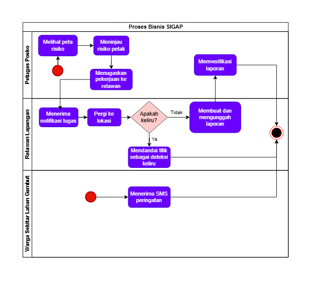
</p>
<p align="center">
<i>Gambar 1. Activity Diagram Proses Bisnis SIGAP</i>
</p>

## 2.2 Deskripsi Umum Perangkat Lunak
SIGAP merupakan aplikasi web dengan dua antarmuka, yaitu aplikasi web untuk petugas posko dan *Progressive Web App* (PWA) untuk relawan lapangan yang tetap dapat dipakai saat luring. Keduanya terhubung ke satu server aplikasi yang menyimpan data di basis data.

SIGAP berinteraksi dengan beberapa sistem eksternal. Setiap 3 jam, layanan cron eksternal memanggil endpoint pembaruan pada server. Server kemudian mengambil data titik panas dari **NASA FIRMS Area API** untuk batas koordinat wilayah percontohan dan data curah hujan harian dari **Open-Meteo Forecast API**, lalu menghitung skor risiko setiap petak lahan. Peta dasar ditampilkan dari tile **OpenStreetMap**. Setiap kali ada petak yang naik ke tingkat risiko tinggi, server mengirim permintaan ke **SMS Gateway** yang pada prototipe ini disimulasikan, yaitu hanya dicatat sebagai log pengiriman tanpa memanggil layanan berbayar.

<p align="center">
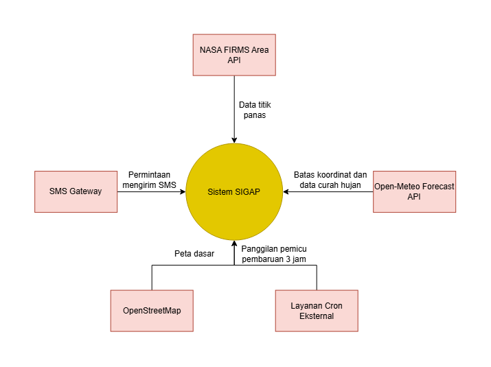
</p>
<p align="center">
<i>Gambar 2. Diagram Konteks SIGAP dan Sistem Eksternal</i>
</p>

## 2.3 Pengguna dan Kebutuhan Pengguna Perangkat Lunak

| Pengguna | Kebutuhan |
| :--- | :--- |
| Petugas Posko | Petugas harus dapat masuk ke sistem, memantau peta risiko per petak lahan, meninjau rekomendasi petak, menyusun dan menugaskan jadwal pencegahan ke relawan, serta memverifikasi laporan bukti kerja relawan. |
| Relawan Lapangan | Relawan harus dapat masuk ke sistem, melihat daftar tugas terurut prioritas, membatalkan tugas yang kondisinya tidak aman, mengunggah foto dan koordinat sebagai bukti kerja termasuk saat luring, serta menandai titik panas yang ternyata keliru. |
| Warga Sekitar Lahan Gambut | Warga harus menerima SMS peringatan dini ketika petak tempat tinggalnya naik ke tingkat risiko tinggi tanpa perlu membuka aplikasi apa pun, serta dapat berhenti berlangganan kapan saja. |

## 2.4 Batasan Perangkat Lunak
1. P/L harus memakai data titik panas dari NASA FIRMS Area API (sumber VIIRS NRT) dengan MAP_KEY gratis, yang dibatasi 5000 transaksi per 10 menit dan rentang 1 sampai 5 hari per permintaan.
2. P/L harus memakai data curah hujan harian dari Open-Meteo Forecast API dengan parameter `past_days` untuk menghitung jumlah hari kering, dan wajib mencantumkan atribusi Open-Meteo pada tampilan peta sesuai lisensi CC BY 4.0. Data curah hujan diambil untuk titik pusat wilayah percontohan dan dipakai untuk seluruh petak.
3. P/L hanya mencakup satu wilayah percontohan setingkat kecamatan berukuran sekitar 20 km × 20 km yang dibagi menjadi petak 1 km × 1 km (sekitar 400 petak).
4. Pengiriman SMS dan balasan STOP disimulasikan karena tim tidak memiliki anggaran layanan SMS gateway berbayar. SMS dicatat pada log, sedangkan balasan STOP dikirim melalui halaman simulasi. Integrasi gateway sungguhan menjadi pengembangan lanjutan di luar cakupan tugas besar.
5. P/L harus berjalan pada peramban web modern. Aplikasi relawan berjalan sebagai PWA pada Chrome Android tanpa instalasi dari toko aplikasi.
6. Penyimpanan laporan luring memakai IndexedDB, karena localStorage dibatasi sekitar 5 MiB dan hanya menyimpan teks.
7. Koordinat bukti kerja diambil dari Geolocation API perangkat dan dapat dipalsukan dengan aplikasi *fake GPS*. Peringatan jarak 200 meter hanya alat bantu, keputusan akhir tetap di tangan petugas posko.
8. Skor risiko adalah alat bantu keputusan, bukan prediksi pasti. Bobot rumus skor ditetapkan tim dan belum dikalibrasi dengan data kejadian kebakaran, dan deteksi satelit bisa terlewat saat petak tertutup awan atau asap tebal.
9. Data master (akun pengguna, relawan, warga, dan petak lahan) diisi melalui skrip *seed* atau impor CSV. P/L tidak menyediakan halaman pengelolaan data master. Pendataan nomor HP warga beserta persetujuannya dilakukan di luar P/L bersama aparat desa sesuai UU PDP.
10. Pengujian dan demo memakai data titik panas historis dari arsip FIRMS yang dimuat melalui skrip, karena masa pengujian bertepatan dengan musim hujan dan titik panas belum tentu muncul di wilayah percontohan.
11. P/L berjalan pada layanan hosting gratis dan harus diakses melalui HTTPS, karena Geolocation API dan PWA hanya berjalan pada koneksi aman.
12. Lokasi relawan hanya diambil saat relawan membuat laporan. P/L tidak melacak lokasi relawan secara terus-menerus.
13. SIGAP adalah prototipe akademik. Seluruh data warga dan relawan pada lingkungan pengembangan, pengujian, dan repositori publik adalah data fiktif.

## 2.5 Lingkungan Operasi Perangkat Lunak

| Komponen | Spesifikasi |
| :--- | :--- |
| Server | Node.js versi LTS (22 atau lebih baru) dengan framework Express, dijalankan pada layanan cloud gratis. |
| Client Petugas | Peramban web modern versi terbaru (Chrome, Edge, atau Firefox) pada komputer atau laptop. |
| Client Relawan | Ponsel Android kelas menengah ke bawah dengan Chrome versi terbaru, GPS dan kamera aktif, dijalankan sebagai PWA. |
| DBMS | PostgreSQL 16 untuk data server. IndexedDB pada peramban relawan untuk laporan luring. |
| Peta | Leaflet dengan tile OpenStreetMap. |
| Penjadwal | Layanan cron eksternal gratis yang memanggil endpoint pembaruan setiap 3 jam. |
| OS | Lintas platform (Windows, Linux, macOS, Android) melalui peramban. |
| Jaringan | HTTPS untuk seluruh akses. |

---

# BAB 3: Deskripsi Kebutuhan Perangkat Lunak

## 3.1 Kebutuhan Fungsional (KF)
KF01 sampai KF16 berasal dari dokumen Requirement Gathering dan telah ditulis ulang dalam format EARS. KF17 sampai KF24 merupakan tambahan pada dokumen ini (lihat Daftar Perubahan).

Tabel 3.1. Kebutuhan Fungsional

| ID KF | ID Kebutuhan | Penjelasan |
| :--- | :--- | :--- |
| KF01 | R01 | Ketika petugas posko membuka menu peta risiko, sistem harus menampilkan peta interaktif dengan setiap petak lahan diberi warna sesuai tingkat risiko terakhir yang tersimpan (rendah, sedang, tinggi). |
| KF02 | R02 | Ketika jadwal pembaruan setiap 3 jam tercapai, sistem harus mengambil data titik panas dari NASA FIRMS dan data curah hujan dari Open-Meteo, lalu menghitung ulang skor risiko setiap petak lahan dengan rumus pembobotan yang telah ditetapkan. |
| KF03 | R03 | Sistem harus membatasi pengambilan data titik panas dan tampilan peta hanya pada batas koordinat wilayah percontohan yang telah dikonfigurasi. |
| KF04 | R04 | Jika pengambilan data dari sumber eksternal gagal, maka sistem harus tetap menampilkan skor risiko hasil perhitungan terakhir beserta keterangan bahwa data belum diperbarui dan waktu pembaruan terakhirnya. |
| KF05 | R05 | Ketika petugas posko membuka menu penyusunan jadwal, sistem harus menampilkan formulir penyusunan jadwal beserta daftar relawan yang berstatus aktif. |
| KF06 | R06 | Jika relawan yang dipilih sudah memiliki 3 tugas aktif, maka sistem harus menolak penyimpanan jadwal dan menampilkan pesan bahwa kapasitas relawan tersebut penuh. |
| KF07 | R07 | Ketika petugas posko menyimpan jadwal baru, sistem harus mengirim notifikasi dalam aplikasi ke akun relawan yang ditugaskan. |
| KF08 | R08 | Ketika petugas posko membuka menu antrean laporan, sistem harus menampilkan daftar laporan berstatus "menunggu verifikasi" beserta tombol setuju dan tolak pada detail setiap laporan. |
| KF09 | R09 | Ketika petugas posko membuka detail laporan, sistem harus menampilkan jarak antara koordinat laporan dan batas petak lokasi tugas (bernilai 0 jika koordinat berada di dalam petak), serta menampilkan peringatan jika jarak tersebut melebihi 200 meter. |
| KF10 | R10 | Selama laporan berstatus "terverifikasi", sistem harus menolak setiap permintaan perubahan data laporan tersebut yang berasal dari akun relawan. |
| KF11 | R11, R12 | Ketika relawan lapangan membuka menu daftar tugas, sistem harus menampilkan tugas aktif milik relawan tersebut terurut dari skor risiko petak tertinggi ke terendah, lengkap dengan lokasi tujuan. |
| KF12 | R13 | Jika relawan lapangan mengirim laporan saat perangkat tidak terhubung ke internet, maka sistem harus menyimpan laporan (foto, koordinat, waktu, dan UUID) di IndexedDB perangkat. |
| KF13 | R14 | Ketika koneksi internet terdeteksi kembali atau aplikasi dibuka ulang, sistem harus mengirim laporan yang tersimpan di perangkat ke server dan mengabaikan laporan dengan UUID yang sudah pernah diterima. |
| KF14 | R15 | Ketika relawan lapangan menekan tombol "tandai keliru" pada detail tugas pengecekan titik panas, sistem harus menampilkan formulir keterangan singkat yang wajib diisi. |
| KF15 | R16 | Ketika relawan lapangan mengirim penandaan deteksi keliru, sistem harus mengubah status titik panas menjadi "keliru" dan tidak menghitungnya dalam skor risiko selama 24 jam, kecuali muncul deteksi baru dalam radius 500 meter dari titik tersebut. |
| KF16 | R17, R18 | Ketika tingkat risiko sebuah petak naik menjadi "tinggi" dan petak tersebut belum dikirimi peringatan dalam 24 jam terakhir, sistem harus mengirim SMS peringatan (disimulasikan) berisi tingkat risiko, tindakan yang disarankan, dan cara berhenti berlangganan ke nomor terdaftar di petak tersebut yang persetujuannya aktif, lalu mencatatnya pada log pengiriman. |
| KF17 | R20 | Ketika petugas posko membuka menu penyusunan jadwal, sistem harus menampilkan maksimal 5 petak lahan berskor risiko tertinggi yang belum memiliki tugas aktif sebagai rekomendasi. |
| KF18 | R21 | Ketika pengguna mengirim username dan password yang valid, sistem harus membuat sesi login dan mengarahkan pengguna ke halaman utama sesuai perannya (petugas posko ke peta risiko, relawan lapangan ke daftar tugas). |
| KF19 | R21 | Jika username atau password yang dikirim tidak valid, maka sistem harus menolak login dan menampilkan pesan kesalahan umum tanpa menyebutkan bagian mana yang salah. |
| KF20 | R21 | Selama sesi login relawan lapangan masih berlaku, sistem harus mengizinkan relawan membuka daftar tugas yang terakhir tersinkron dan mengisi laporan tanpa login ulang, termasuk saat perangkat luring. |
| KF21 | R22 | Ketika relawan lapangan membatalkan tugas dengan alasan kondisi lokasi tidak aman, sistem harus mengubah status tugas menjadi "dibatalkan", menyimpan alasannya, dan mengirim notifikasi dalam aplikasi ke petugas posko. |
| KF22 | R23 | Ketika sistem menerima balasan "STOP" dari nomor terdaftar (disimulasikan), sistem harus mengubah status persetujuan nomor tersebut menjadi "dicabut" dan tidak lagi mengirim SMS ke nomor tersebut. |
| KF23 | R24 | Sistem harus menampilkan pada halaman peta risiko atribusi sumber data (NASA FIRMS dan Open-Meteo), waktu pembaruan data, serta pernyataan bahwa skor risiko adalah alat bantu keputusan dan tidak adanya peringatan tidak menjamin kondisi aman. |
| KF24 | R08, R10 | Ketika petugas posko menyetujui atau menolak laporan bukti kerja, sistem harus mengubah status tugas terkait menjadi "selesai" (jika disetujui) atau kembali "ditugaskan" (jika ditolak), lalu mengirim notifikasi dalam aplikasi ke relawan pengunggah. |

Rumus skor risiko yang dirujuk KF02 adalah:

```
skor = w1 × jumlah titik panas + w3 × jumlah hari kering − w2 × curah hujan
```

dengan *jumlah titik panas* adalah titik panas pada petak dalam 24 jam terakhir yang tidak berstatus "keliru" (KF15), *curah hujan* adalah total curah hujan 24 jam terakhir dalam mm, dan *jumlah hari kering* adalah jumlah hari berturut-turut dengan curah hujan harian di bawah 1 mm. Nilai w1, w2, w3 dan ambang tingkat rendah, sedang, dan tinggi disimpan sebagai konfigurasi sistem.

Siklus status tugas yang dirujuk KF06, KF21, dan KF24: tugas dibuat dengan status "ditugaskan", berubah menjadi "menunggu verifikasi" saat laporan diterima server, lalu menjadi "selesai" jika laporan disetujui atau kembali "ditugaskan" jika ditolak. Relawan dapat mengubah tugas berstatus "ditugaskan" menjadi "dibatalkan". Tugas aktif adalah tugas berstatus "ditugaskan" atau "menunggu verifikasi".

Kebutuhan R20 sampai R24 belum ada pada tabel Pemetaan Kebutuhan dokumen Requirement Gathering, sehingga didefinisikan di sini.

Tabel 3.1.2. Kebutuhan Tambahan

| ID Kebutuhan | ID Aktivitas | Jenis Kebutuhan | Deskripsi Kebutuhan | P/L |
| :--- | :--- | :--- | :--- | :--- |
| R20 | A02 | System | Sistem menyarankan petak lahan yang perlu ditugaskan berdasarkan skor risiko tertinggi. | Ya |
| R21 | A02, A03, A04, A05 | System | Sistem membedakan akses petugas posko dan relawan lapangan melalui akun masing-masing. | Ya |
| R22 | A04 | User | Relawan dapat membatalkan tugas jika kondisi lokasi tidak aman tanpa dianggap lalai. | Ya |
| R23 | A07 | Legal | Warga dapat mencabut persetujuan menerima SMS kapan saja, dan nomornya dihapus setelah dicabut (UU PDP). | Ya |
| R24 | A01 | Business | Peta risiko mencantumkan sumber data dan batasan skor agar tidak dianggap sebagai jaminan kondisi aman. | Ya |

## 3.2 Kebutuhan Non-Fungsional (KNF)

Tabel 3.2. Kebutuhan Non-Fungsional

| ID KNF | ID Kebutuhan | Parameter | Deskripsi Kebutuhan |
| :--- | :--- | :--- | :--- |
| KNF01 | R02 | Response time | Ketika petugas posko membuka peta risiko, sistem harus menyelesaikan pemuatan peta beserta warna petak dalam waktu maksimal 5 detik saat diuji dengan throttling jaringan 3G pada Chrome DevTools. |
| KNF02 | R04 | Reliability | Ketika FIRMS atau Open-Meteo tidak dapat diakses, sistem harus tetap menampilkan peta menggunakan hasil perhitungan terakhir beserta keterangan waktu pembaruan. |
| KNF03 | R13, R14 | Reliability | Ketika sinkronisasi laporan luring terputus di tengah pengiriman, sistem harus memastikan tidak ada laporan ganda yang tersimpan di server dengan menolak UUID yang sudah terdaftar. |
| KNF04 | R13 | Portability | Aplikasi relawan harus dapat berjalan pada perangkat Android kelas menengah ke bawah melalui peramban sebagai PWA, tanpa instalasi dari toko aplikasi. |
| KNF05 | R19 | Security | Nomor HP warga dan foto bukti kerja hanya boleh diakses melalui endpoint yang memerlukan login dengan peran yang sesuai, dan seluruh komunikasi antara klien dan server harus memakai HTTPS. Nomor HP warga hanya dapat dilihat oleh petugas posko. |
| KNF06 | R09 | Accuracy | Sistem harus menandai laporan yang jaraknya lebih dari 200 meter dari batas petak lokasi tugas, mengikuti akurasi GPS ponsel pada umumnya. Jarak dihitung dengan rumus haversine. |
| KNF07 | R02 | Availability | Platform peta dan penugasan harus dapat diakses tanpa gangguan selama sesi pengujian dan demo tugas besar berlangsung. |
| KNF08 | R13 | Ergonomy | Antarmuka pengisian laporan relawan harus dapat dioperasikan dengan satu tangan (tombol aksi utama pada 40% bagian bawah layar) dan tetap terbaca di bawah sinar matahari langsung (kontras teks dan latar minimal 4,5:1, target sentuh minimal 48×48 dp). |
| KNF09 | R13 | Memory | Penyimpanan lokal laporan luring yang belum terkirim dibatasi maksimal 20 laporan, dan setiap foto dikompres di perangkat menjadi maksimal 500 KB sebelum disimpan. |
| KNF10 | R17 | Safety | Ketika perhitungan skor menunjukkan petak berpenghuni naik ke tingkat tinggi, sistem harus mencatat pengiriman SMS peringatan (disimulasikan) paling lambat 15 menit sejak perhitungan tersebut selesai. |
| KNF11 | R21 | Security | Password pengguna harus disimpan dalam bentuk hash bcrypt, tidak pernah dalam bentuk teks biasa, dan sesi login kedaluwarsa setelah 7 hari tidak aktif. |
| KNF12 | R23 | Security | Sistem harus menghapus nomor HP yang persetujuannya dicabut paling lambat 30 hari setelah pencabutan. |

---

# BAB 4: Pemodelan Use Case

## 4.1 Identifikasi Aktor

| ID Aktor | Aktor | Deskripsi |
| :--- | :--- | :--- |
| AK01 | Petugas Posko | Bertanggung jawab memantau peta risiko, menyusun dan menugaskan jadwal pekerjaan pencegahan, serta memverifikasi laporan bukti kerja relawan. Bekerja dari posko dengan koneksi internet relatif stabil. |
| AK02 | Relawan Lapangan | Menerima penugasan patroli atau pengecekan titik panas, lalu mengunggah foto dan koordinat sebagai bukti kerja di lokasi. Bekerja berpindah-pindah di area dengan sinyal internet lemah atau tidak ada sama sekali. |
| AK03 | Warga Sekitar Lahan Gambut | Penerima peringatan dini lewat SMS ketika petak tempat tinggalnya naik ke tingkat risiko tinggi, termasuk kontak perangkat desa/RT yang meneruskan peringatan. Tidak login atau membuka antarmuka apa pun. Satu-satunya interaksi balik adalah membalas STOP untuk berhenti berlangganan. |

## 4.2 Identifikasi Use Case

| ID UC | Nama Use Case | Deskripsi Singkat | Aktor | ID KF |
| :--- | :--- | :--- | :--- | :--- |
| UC01 | Memantau Peta Risiko Kebakaran | Petugas melihat peta risiko petak lahan beserta sumber data dan batasannya, termasuk saat pembaruan data terakhir gagal (memakai cache). | Petugas Posko | KF01, KF02, KF03, KF04, KF23 |
| UC02 | Menyusun dan Menugaskan Jadwal Pencegahan | Petugas meninjau rekomendasi petak, menyusun jadwal, dan menugaskannya ke relawan aktif. Sistem menolak jika kapasitas relawan penuh dan mengirim notifikasi penugasan. | Petugas Posko | KF05, KF06, KF07, KF17 |
| UC03 | Memverifikasi Laporan Bukti Kerja | Petugas meninjau foto dan koordinat bukti kerja relawan lalu menyetujui atau menolaknya. Laporan yang disetujui dikunci dan tugasnya dinyatakan selesai. | Petugas Posko | KF08, KF09, KF10, KF24 |
| UC04 | Melihat Daftar Tugas Prioritas | Relawan membuka daftar tugas yang terurut berdasarkan skor risiko, termasuk saat luring, dan dapat membatalkan tugas yang kondisinya tidak aman. | Relawan Lapangan | KF11, KF20, KF21 |
| UC05 | Mengunggah Laporan Bukti Kerja | Relawan mengisi dan mengirim laporan foto beserta koordinat, termasuk saat luring (tersimpan di perangkat dan terkirim otomatis saat sinyal kembali). | Relawan Lapangan | KF12, KF13 |
| UC06 | Menandai Titik Panas sebagai Deteksi Keliru | Relawan menandai titik panas pada tugas pengecekan sebagai deteksi keliru disertai keterangan. | Relawan Lapangan | KF14, KF15 |
| UC07 | Menerima Peringatan Dini via SMS | Warga menerima SMS otomatis ketika petak tempat tinggalnya naik ke tingkat risiko tinggi, dan dapat berhenti berlangganan dengan membalas STOP. | Warga Sekitar Lahan Gambut | KF16, KF22 |
| UC08 | Masuk ke Sistem | Petugas atau relawan masuk dengan akun sesuai perannya. Sesi relawan tetap berlaku saat luring. | Petugas Posko, Relawan Lapangan | KF18, KF19, KF20 |

## 4.3 Use Case Diagram

<p align="center">
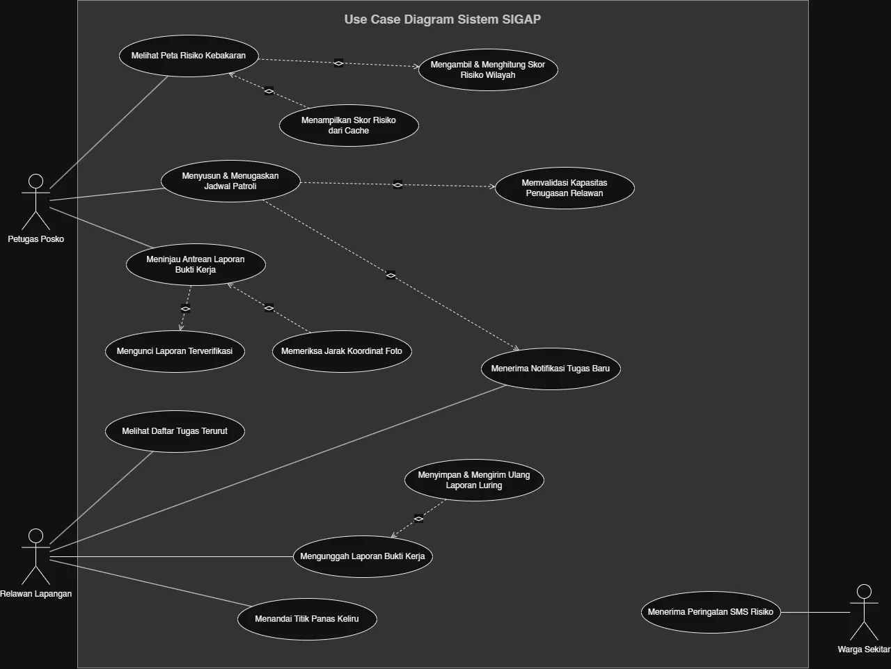
</p>
<p align="center">
<i>Gambar 3. Use Case Diagram SIGAP</i>
</p>

## 4.4 Skenario Use Case

### 4.4.1 Skenario UC01

**Nama Use Case:** Memantau Peta Risiko Kebakaran

**Skenario Normal**

| No | Aksi Aktor | Reaksi Perangkat Lunak |
| :--- | :--- | :--- |
| 1 | Petugas posko membuka menu peta risiko | Sistem mengambil hasil perhitungan skor risiko terakhir untuk setiap petak di dalam batas wilayah percontohan |
| 2 | - | Sistem menampilkan peta interaktif dengan petak lahan berwarna sesuai tingkat risiko, beserta waktu pembaruan data, atribusi sumber data, dan pernyataan bahwa skor adalah alat bantu keputusan |

**Skenario Alternatif 1: Pembaruan data terakhir gagal**

| No | Aksi Aktor | Reaksi Perangkat Lunak |
| :--- | :--- | :--- |
| 1 | Petugas posko membuka menu peta risiko | Sistem mendeteksi bahwa pembaruan data terakhir gagal karena API FIRMS atau Open-Meteo tidak merespons |
| 2 | - | Sistem mengambil hasil perhitungan terakhir yang berhasil dari cache |
| 3 | - | Sistem menampilkan peta dari data cache disertai keterangan bahwa data belum diperbarui beserta waktu pembaruan terakhirnya |

### 4.4.2 Skenario UC02

**Nama Use Case:** Menyusun dan Menugaskan Jadwal Pencegahan

**Skenario Normal**

| No | Aksi Aktor | Reaksi Perangkat Lunak |
| :--- | :--- | :--- |
| 1 | Petugas posko membuka menu penyusunan jadwal | Sistem menampilkan formulir penyusunan jadwal, daftar relawan berstatus aktif, dan maksimal 5 petak rekomendasi berskor tertinggi yang belum memiliki tugas aktif |
| 2 | Petugas posko memilih petak, mengisi jenis pekerjaan dan tanggal, lalu memilih relawan | Sistem memeriksa bahwa relawan terpilih memiliki kurang dari 3 tugas aktif |
| 3 | Petugas posko menekan tombol simpan jadwal | Sistem menyimpan jadwal dengan status "ditugaskan" dan mengirim notifikasi dalam aplikasi ke relawan yang ditugaskan |

**Skenario Alternatif 1: Kapasitas relawan penuh**

| No | Aksi Aktor | Reaksi Perangkat Lunak |
| :--- | :--- | :--- |
| 1 | Petugas posko membuka menu penyusunan jadwal | Sistem menampilkan formulir penyusunan jadwal, daftar relawan aktif, dan petak rekomendasi |
| 2 | Petugas posko mengisi detail pekerjaan, memilih relawan, lalu menekan tombol simpan jadwal | Sistem mendeteksi bahwa relawan terpilih sudah memiliki 3 tugas aktif, menolak penyimpanan, dan menampilkan pesan bahwa kapasitas relawan tersebut penuh |
| 3 | Petugas posko memilih relawan lain lalu menyimpan kembali | Sistem memproses sesuai skenario normal langkah 2 sampai 3 |

### 4.4.3 Skenario UC03

**Nama Use Case:** Memverifikasi Laporan Bukti Kerja

**Skenario Normal**

| No | Aksi Aktor | Reaksi Perangkat Lunak |
| :--- | :--- | :--- |
| 1 | Petugas posko membuka menu antrean laporan bukti kerja | Sistem menampilkan daftar laporan berstatus "menunggu verifikasi" beserta nama relawan dan waktu unggah |
| 2 | Petugas posko memilih salah satu laporan pada antrean | Sistem menampilkan detail laporan (foto, koordinat unggahan, petak lokasi tugas, dan jarak koordinat ke batas petak) beserta tombol setuju dan tolak |
| 3 | Petugas posko menekan tombol setuju | Sistem mengubah status laporan menjadi "terverifikasi", mencatat petugas pemverifikasi dan waktunya, mengunci laporan dari perubahan oleh relawan, mengubah status tugas menjadi "selesai", mengirim notifikasi ke relawan, lalu kembali ke antrean laporan |

**Skenario Alternatif 1: Jarak koordinat melebihi 200 meter**

| No | Aksi Aktor | Reaksi Perangkat Lunak |
| :--- | :--- | :--- |
| 1 | Petugas posko membuka menu antrean laporan bukti kerja | Sistem menampilkan daftar laporan berstatus "menunggu verifikasi" beserta nama relawan dan waktu unggah |
| 2 | Petugas posko memilih salah satu laporan pada antrean | Sistem menghitung jarak koordinat unggahan ke batas petak lokasi tugas, mendeteksi jarak melebihi 200 meter, lalu menampilkan detail laporan disertai peringatan bahwa lokasi bukti kerja berada di luar radius wajar |
| 3 | Petugas posko meninjau peringatan lalu menekan tombol setuju atau tolak | Sistem memproses keputusan petugas sesuai skenario normal langkah 3 (jika setuju) atau skenario alternatif 2 langkah 3 (jika tolak) |

**Skenario Alternatif 2: Petugas menolak laporan**

| No | Aksi Aktor | Reaksi Perangkat Lunak |
| :--- | :--- | :--- |
| 1 | Petugas posko membuka menu antrean laporan bukti kerja | Sistem menampilkan daftar laporan berstatus "menunggu verifikasi" beserta nama relawan dan waktu unggah |
| 2 | Petugas posko memilih salah satu laporan pada antrean | Sistem menampilkan detail laporan beserta tombol setuju dan tolak |
| 3 | Petugas posko menekan tombol tolak dan mengisi alasan penolakan | Sistem mengubah status laporan menjadi "ditolak", menyimpan alasan penolakan, mengembalikan status tugas menjadi "ditugaskan", lalu mengirim notifikasi ke relawan agar dapat mengunggah ulang bukti kerja |

**Skenario Alternatif 3: Tidak ada laporan pada antrean**

| No | Aksi Aktor | Reaksi Perangkat Lunak |
| :--- | :--- | :--- |
| 1 | Petugas posko membuka menu antrean laporan bukti kerja | Sistem mendeteksi tidak ada laporan berstatus "menunggu verifikasi" dan menampilkan pesan bahwa antrean laporan sedang kosong |

### 4.4.4 Skenario UC04

**Nama Use Case:** Melihat Daftar Tugas Prioritas

**Skenario Normal**

| No | Aksi Aktor | Reaksi Perangkat Lunak |
| :--- | :--- | :--- |
| 1 | Relawan lapangan membuka menu daftar tugas | Sistem menampilkan tugas aktif milik relawan tersebut, terurut dari skor risiko petak tertinggi ke terendah, lengkap dengan lokasi tujuan dan status tugas, lalu menyimpan salinannya di perangkat |
| 2 | Relawan lapangan memilih salah satu tugas pada daftar | Sistem menampilkan detail tugas berupa petak lokasi tujuan, skor risiko petak, jenis pekerjaan, dan tombol pembatalan karena tidak aman |

**Skenario Alternatif 1: Perangkat luring**

| No | Aksi Aktor | Reaksi Perangkat Lunak |
| :--- | :--- | :--- |
| 1 | Relawan lapangan membuka menu daftar tugas saat perangkat tidak terhubung ke internet | Sistem mendeteksi perangkat luring dan sesi login masih berlaku, lalu menampilkan salinan daftar tugas yang terakhir tersinkron disertai penanda luring dan waktu sinkronisasi terakhir |
| 2 | Relawan lapangan memilih salah satu tugas pada daftar | Sistem menampilkan detail tugas dari salinan di perangkat |

**Skenario Alternatif 2: Belum ada tugas**

| No | Aksi Aktor | Reaksi Perangkat Lunak |
| :--- | :--- | :--- |
| 1 | Relawan lapangan membuka menu daftar tugas | Sistem mendeteksi relawan belum memiliki tugas aktif dan menampilkan pesan bahwa belum ada penugasan |

**Skenario Alternatif 3: Relawan membatalkan tugas karena kondisi tidak aman**

| No | Aksi Aktor | Reaksi Perangkat Lunak |
| :--- | :--- | :--- |
| 1 | Relawan lapangan memilih tugas pada daftar | Sistem menampilkan detail tugas beserta tombol pembatalan karena tidak aman |
| 2 | Relawan lapangan menekan tombol pembatalan dan mengisi alasan (misalnya api sudah membesar atau asap terlalu pekat) | Sistem mengubah status tugas menjadi "dibatalkan", menyimpan alasannya, dan mengirim notifikasi ke petugas posko |

### 4.4.5 Skenario UC05

**Nama Use Case:** Mengunggah Laporan Bukti Kerja

**Skenario Normal**

| No | Aksi Aktor | Reaksi Perangkat Lunak |
| :--- | :--- | :--- |
| 1 | Relawan memilih menu membuat laporan pada suatu tugas | Sistem membuat UUID laporan, menampilkan formulir laporan, dan mengisi koordinat dari GPS perangkat |
| 2 | Relawan mengambil foto kondisi lapangan | Sistem mengompres foto dan menyimpannya pada formulir |
| 3 | Relawan menekan tombol kirim laporan | Sistem mengirim laporan ke server, menampilkannya pada antrean petugas posko, dan mengubah status tugas menjadi "menunggu verifikasi" |

**Skenario Alternatif 1: Perangkat tidak terhubung ke internet**

| No | Aksi Aktor | Reaksi Perangkat Lunak |
| :--- | :--- | :--- |
| 1 | Relawan memilih menu membuat laporan pada suatu tugas | Sistem membuat UUID laporan, menampilkan formulir laporan, dan mengisi koordinat dari GPS perangkat |
| 2 | Relawan mengambil foto kondisi lapangan | Sistem mengompres foto dan menyimpannya pada formulir |
| 3 | Relawan menekan tombol kirim laporan | Sistem mendeteksi perangkat luring, menyimpan laporan di IndexedDB, dan menampilkan status "menunggu dikirim" |
| 4 | Relawan kembali ke area bersinyal atau membuka ulang aplikasi | Sistem mendeteksi koneksi tersedia dan mengirim laporan tersimpan secara otomatis. Server mengabaikan laporan yang UUID-nya sudah pernah diterima |

**Skenario Alternatif 2: GPS perangkat belum dinyalakan**

| No | Aksi Aktor | Reaksi Perangkat Lunak |
| :--- | :--- | :--- |
| 1 | Relawan memilih menu membuat laporan pada suatu tugas | Sistem mendeteksi GPS belum dinyalakan dan menampilkan peringatan agar relawan menyalakan GPS |
| 2 | Relawan menyalakan GPS perangkat | Sistem mendeteksi GPS sudah aktif dan mengisi koordinat |
| 3 | Relawan mengambil foto kondisi lapangan | Kembali ke skenario normal langkah 2 |

**Skenario Alternatif 3: Penyimpanan lokal penuh**

| No | Aksi Aktor | Reaksi Perangkat Lunak |
| :--- | :--- | :--- |
| 1 | Relawan menekan tombol kirim laporan saat perangkat luring | Sistem mendeteksi sudah ada 20 laporan yang belum terkirim di perangkat |
| 2 | - | Sistem menolak menyimpan laporan baru dan menampilkan pesan agar relawan mencari area bersinyal untuk mengirim laporan yang tertunda lebih dulu |

### 4.4.6 Skenario UC06

**Nama Use Case:** Menandai Titik Panas sebagai Deteksi Keliru

**Skenario Normal**

| No | Aksi Aktor | Reaksi Perangkat Lunak |
| :--- | :--- | :--- |
| 1 | Relawan menekan tombol "tandai keliru" pada detail tugas pengecekan titik panas | Sistem menampilkan formulir keterangan singkat yang wajib diisi |
| 2 | Relawan mengisi keterangan dan menekan tombol kirim | Sistem mengubah status titik panas menjadi "keliru" beserta keterangannya, sehingga titik tersebut tidak dihitung dalam skor risiko selama 24 jam |

**Skenario Alternatif 1: Relawan tidak mengisi kolom keterangan**

| No | Aksi Aktor | Reaksi Perangkat Lunak |
| :--- | :--- | :--- |
| 1 | Relawan menekan tombol "tandai keliru" pada detail tugas pengecekan titik panas | Sistem menampilkan formulir keterangan singkat |
| 2 | Relawan tidak mengisi keterangan dan langsung menekan tombol kirim | Sistem menampilkan peringatan bahwa keterangan belum diisi |
| 3 | Relawan mengisi keterangan | Kembali ke skenario normal langkah 2 |

### 4.4.7 Skenario UC07

**Nama Use Case:** Menerima Peringatan Dini via SMS

**Skenario Normal**

| No | Aksi Aktor | Reaksi Perangkat Lunak |
| :--- | :--- | :--- |
| 1 | - | Setelah perhitungan skor, sistem mendeteksi sebuah petak berpenghuni naik ke tingkat risiko tinggi dan petak tersebut belum dikirimi peringatan dalam 24 jam terakhir |
| 2 | - | Sistem mengambil nomor HP terdaftar di petak tersebut yang status persetujuannya aktif |
| 3 | - | Sistem menyusun SMS berisi tingkat risiko, tindakan yang disarankan, dan cara berhenti berlangganan, mengirimnya melalui SMS gateway (disimulasikan), lalu mencatat status "terkirim" pada log |
| 4 | Warga menerima dan membaca SMS peringatan dini | - |

**Skenario Alternatif 1: Nomor tidak aktif**

| No | Aksi Aktor | Reaksi Perangkat Lunak |
| :--- | :--- | :--- |
| 1 | - | Sistem mendeteksi petak tempat tinggal warga naik ke tingkat risiko tinggi |
| 2 | - | Sistem mengambil nomor HP terdaftar di petak tersebut |
| 3 | - | Sistem mengirim SMS, tetapi gateway (disimulasikan) mengembalikan status gagal karena nomor tidak aktif |
| 4 | - | Sistem mencatat status "gagal" pada log agar petugas dapat menghubungi perangkat desa setempat secara manual |

**Skenario Alternatif 2: Warga berhenti berlangganan**

| No | Aksi Aktor | Reaksi Perangkat Lunak |
| :--- | :--- | :--- |
| 1 | Warga membalas SMS peringatan dengan "STOP" | Sistem menerima balasan melalui SMS gateway (disimulasikan) dan mencocokkan nomor pengirim dengan data penerima terdaftar |
| 2 | - | Sistem mengubah status persetujuan nomor tersebut menjadi "dicabut", mencatat waktunya, dan tidak lagi menyertakan nomor tersebut pada pengiriman berikutnya |

### 4.4.8 Skenario UC08

**Nama Use Case:** Masuk ke Sistem

**Skenario Normal**

| No | Aksi Aktor | Reaksi Perangkat Lunak |
| :--- | :--- | :--- |
| 1 | Pengguna (petugas posko atau relawan lapangan) membuka aplikasi | Sistem menampilkan halaman login |
| 2 | Pengguna mengisi username dan password, lalu menekan tombol masuk | Sistem memverifikasi kredensial, membuat sesi login, dan mengarahkan pengguna sesuai perannya: petugas ke peta risiko, relawan ke daftar tugas |

**Skenario Alternatif 1: Kredensial tidak valid**

| No | Aksi Aktor | Reaksi Perangkat Lunak |
| :--- | :--- | :--- |
| 1 | Pengguna membuka aplikasi | Sistem menampilkan halaman login |
| 2 | Pengguna mengisi username atau password yang salah, lalu menekan tombol masuk | Sistem menolak login dan menampilkan pesan "Username atau password salah" |
| 3 | Pengguna mengisi ulang kredensial yang benar | Kembali ke skenario normal langkah 2 |

**Skenario Alternatif 2: Relawan membuka aplikasi saat luring**

| No | Aksi Aktor | Reaksi Perangkat Lunak |
| :--- | :--- | :--- |
| 1 | Relawan lapangan membuka aplikasi saat perangkat tidak terhubung ke internet | Sistem memeriksa sesi login yang tersimpan di perangkat. Jika masih berlaku, sistem langsung menampilkan daftar tugas terakhir tersinkron. Jika belum ada sesi, sistem menampilkan halaman login dengan pesan bahwa login memerlukan koneksi internet |

---

# BAB 5: Pemodelan Kelas

Diagram kelas SIGAP menggunakan pola *Boundary-Control-Entity* (BCE). *Boundary* adalah antarmuka yang langsung dilihat dan dipakai pengguna. *Control* menjalankan logika bisnis dan menjadi penghubung antara antarmuka dan data. *Entity* menyimpan data persisten yang tetap ada meskipun aplikasi ditutup. Panah garis penuh dari *control* ke *entity* berarti *control* membuat atau mengubah data *entity* tersebut, sedangkan panah garis putus-putus berarti *dependency*, yaitu kelas hanya dibaca atau dipanggil sesaat. Garis tanpa panah antar-*entity* adalah asosiasi dengan multiplisitas, dan belah ketupat kosong menunjukkan agregasi.

## 5.1 Identifikasi Kelas

| ID Kelas | Nama Kelas | Deskripsi Kelas | ID Use Case |
| :--- | :--- | :--- | :--- |
| C01 | `HalamanPetaRisiko` | *Boundary*. Antarmuka peta risiko yang dilihat petugas posko. | UC01 |
| C02 | `PetaRisikoController` | *Control*. Mengambil data titik panas dan curah hujan, menghitung skor risiko, menangani fallback ke cache, dan memicu pengecekan ambang peringatan. | UC01 |
| C03 | `PetakLahan` | *Entity*. Menyimpan batas wilayah, skor risiko, tingkat risiko, dan waktu pembaruan terakhir suatu petak lahan. | UC01, UC02, UC04, UC07 |
| C04 | `TitikPanas` | *Entity*. Menyimpan data titik panas dari FIRMS beserta status validitas dan keterangan penandaan keliru. | UC01, UC06 |
| C05 | `FormPenyusunanJadwal` | *Boundary*. Antarmuka penyusunan jadwal, rekomendasi petak, dan pemilihan relawan oleh petugas posko. | UC02 |
| C06 | `JadwalController` | *Control*. Menyusun rekomendasi petak, memvalidasi kapasitas relawan, membuat jadwal, dan mengirim notifikasi penugasan. | UC02 |
| C07 | `JadwalPekerjaan` | *Entity*. Menyimpan detail satu tugas pencegahan: jenis pekerjaan, status, tanggal, dan alasan pembatalan. | UC02, UC03, UC04, UC05 |
| C08 | `RelawanLapangan` | *Entity*. Menyimpan data relawan: identitas, kontak, dan status keaktifan. | UC02 |
| C09 | `HalamanAntreanLaporan` | *Boundary*. Antarmuka antrean dan detail laporan bukti kerja untuk petugas posko. | UC03 |
| C10 | `VerifikasiLaporanController` | *Control*. Menghitung jarak koordinat laporan ke petak tugas, memproses persetujuan atau penolakan, mengunci laporan, dan memperbarui status tugas. | UC03 |
| C11 | `LaporanBuktiKerja` | *Entity*. Menyimpan UUID laporan, foto, koordinat unggahan, jarak ke petak tugas, status verifikasi, dan waktu verifikasi. | UC03, UC05 |
| C12 | `HalamanDaftarTugas` | *Boundary*. Antarmuka daftar dan detail tugas relawan. | UC04 |
| C13 | `DaftarTugasController` | *Control*. Mengambil dan mengurutkan tugas relawan, menyimpan salinannya di perangkat, dan memproses pembatalan tugas. | UC04 |
| C14 | `FormLaporanBuktiKerja` | *Boundary*. Antarmuka pengisian laporan bukti kerja (foto dan koordinat). | UC05 |
| C15 | `UploadLaporanController` | *Control*. Membuat UUID, mengompres foto, mendeteksi koneksi, menyimpan laporan di perangkat, dan menyinkronkannya saat koneksi tersedia. | UC05 |
| C16 | `DialogTandaiKeliru` | *Boundary*. Antarmuka penandaan titik panas sebagai deteksi keliru. | UC06 |
| C17 | `DeteksiKeliruController` | *Control*. Memvalidasi keterangan dan mengubah status titik panas menjadi keliru. | UC06 |
| C18 | `PeringatanSMSController` | *Control*. Mengecek petak yang naik ke tingkat tinggi, mencegah pengiriman ulang dalam 24 jam, mengirim SMS (simulasi), memproses balasan STOP, dan menghapus nomor yang persetujuannya dicabut. | UC07 |
| C19 | `Warga` | *Entity*. Menyimpan nomor HP penerima, status persetujuan, dan waktu pencabutan persetujuan. | UC07 |
| C20 | `PeringatanSMS` | *Entity*. Log pengiriman SMS: isi pesan, waktu kirim, dan status. | UC07 |
| C21 | `HalamanLogin` | *Boundary*. Antarmuka masuk ke sistem. | UC08 |
| C22 | `AutentikasiController` | *Control*. Memverifikasi kredensial, membuat dan memeriksa sesi, serta mengarahkan pengguna sesuai perannya. | UC08 |
| C23 | `Pengguna` | *Entity*. Menyimpan akun pengguna: username, hash password, dan peran. | UC03, UC08 |
| C24 | `Notifikasi` | *Entity*. Menyimpan notifikasi dalam aplikasi: isi pesan, waktu dibuat, dan status sudah dibaca. | UC02, UC03, UC04 |

## 5.2 Diagram Kelas per Use Case

### 5.2.1 Use Case UC01

**Nama Use Case:** *Memantau Peta Risiko Kebakaran*

<p align="center">
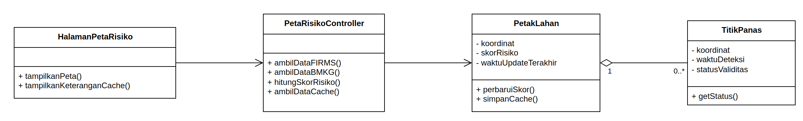
</p>
<p align="center">
<i>Gambar 4. Diagram Kelas Use Case UC01</i>
</p>

| ID Kelas | Nama Kelas | Atribut | Metode/Operasi |
| :--- | :--- | :--- | :--- |
| C01 | `HalamanPetaRisiko` | - | `tampilkanPeta()`, `tampilkanKeteranganCache()`, `tampilkanAtribusi()` |
| C02 | `PetaRisikoController` | - | `ambilDataTitikPanas()`, `ambilDataCuaca()`, `hitungSkorRisiko()`, `ambilDataCache()`, `picuCekAmbang()` |
| C03 | `PetakLahan` | `idPetak`, `batasWilayah`, `skorRisiko`, `tingkatRisiko`, `waktuUpdateTerakhir` | `perbaruiSkor()`, `simpanCache()`, `getTingkatRisiko()` |
| C04 | `TitikPanas` | `idTitikPanas`, `koordinat`, `waktuDeteksi`, `statusValiditas`, `keterangan`, `waktuTandaiKeliru` | `getStatus()`, `tandaiKeliru()`, `isDikecualikan()` |

Relasi: `PetakLahan` **agregasi** ke `TitikPanas` (1 ke 0..*), karena titik panas tetap bermakna sebagai data mentah FIRMS walaupun skor petaknya belum dihitung.

### 5.2.2 Use Case UC02

**Nama Use Case:** *Menyusun dan Menugaskan Jadwal Pencegahan*

<p align="center">
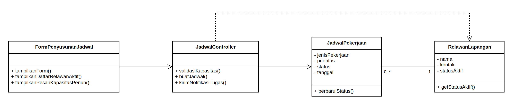
</p>
<p align="center">
<i>Gambar 5. Diagram Kelas Use Case UC02</i>
</p>

| ID Kelas | Nama Kelas | Atribut | Metode/Operasi |
| :--- | :--- | :--- | :--- |
| C05 | `FormPenyusunanJadwal` | - | `tampilkanForm()`, `tampilkanRekomendasi()`, `tampilkanDaftarRelawanAktif()`, `tampilkanPesanKapasitasPenuh()` |
| C06 | `JadwalController` | - | `buatRekomendasi()`, `validasiKapasitas()`, `buatJadwal()`, `kirimNotifikasiTugas()` |
| C07 | `JadwalPekerjaan` | `idJadwal`, `jenisPekerjaan`, `status`, `tanggal`, `alasanPembatalan` | `perbaruiStatus()`, `batalkan()` |
| C08 | `RelawanLapangan` | `idRelawan`, `nama`, `kontak`, `statusAktif` | `getStatusAktif()`, `hitungTugasAktif()` |
| C03 | `PetakLahan` | `idPetak`, `batasWilayah`, `skorRisiko`, `tingkatRisiko`, `waktuUpdateTerakhir` | `perbaruiSkor()`, `simpanCache()`, `getTingkatRisiko()` |
| C24 | `Notifikasi` | `idNotifikasi`, `isiPesan`, `waktuDibuat`, `sudahDibaca` | `tandaiDibaca()` |

Relasi: `JadwalController` bergantung (**dependency**) pada `RelawanLapangan` dan `PetakLahan` karena keduanya hanya dibaca saat validasi kapasitas dan penyusunan rekomendasi. `JadwalPekerjaan` **asosiasi** ke `RelawanLapangan` (0..* ke 1, ditugaskan ke) dan ke `PetakLahan` (0..* ke 1, berlokasi di).

### 5.2.3 Use Case UC03

**Nama Use Case:** *Memverifikasi Laporan Bukti Kerja*

<p align="center">
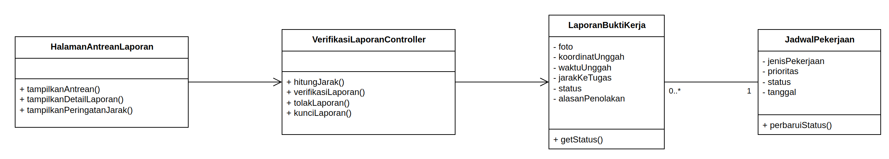
</p>
<p align="center">
<i>Gambar 6. Diagram Kelas Use Case UC03</i>
</p>

| ID Kelas | Nama Kelas | Atribut | Metode/Operasi |
| :--- | :--- | :--- | :--- |
| C09 | `HalamanAntreanLaporan` | - | `tampilkanAntrean()`, `tampilkanDetailLaporan()`, `tampilkanPeringatanJarak()`, `tampilkanAntreanKosong()` |
| C10 | `VerifikasiLaporanController` | - | `hitungJarak()`, `verifikasiLaporan()`, `tolakLaporan()`, `kunciLaporan()`, `perbaruiStatusTugas()` |
| C11 | `LaporanBuktiKerja` | `idLaporan`, `foto`, `koordinatUnggah`, `waktuUnggah`, `jarakKeTugas`, `status`, `alasanPenolakan`, `waktuVerifikasi` | `getStatus()`, `isTerkunci()` |
| C07 | `JadwalPekerjaan` | `idJadwal`, `jenisPekerjaan`, `status`, `tanggal`, `alasanPembatalan` | `perbaruiStatus()`, `batalkan()` |
| C23 | `Pengguna` | `idPengguna`, `username`, `passwordHash`, `peran` | `cekPassword()`, `getPeran()` |
| C24 | `Notifikasi` | `idNotifikasi`, `isiPesan`, `waktuDibuat`, `sudahDibaca` | `tandaiDibaca()` |

Relasi: `LaporanBuktiKerja` **asosiasi** ke `JadwalPekerjaan` (0..* ke 1, bukti untuk) dan ke `Pengguna` (0..* ke 0..1, diverifikasi oleh). `Notifikasi` **asosiasi** ke `Pengguna` (0..* ke 1, ditujukan ke).

### 5.2.4 Use Case UC04

**Nama Use Case:** *Melihat Daftar Tugas Prioritas*

<p align="center">
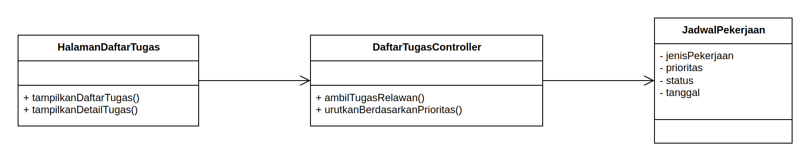
</p>
<p align="center">
<i>Gambar 7. Diagram Kelas Use Case UC04</i>
</p>

| ID Kelas | Nama Kelas | Atribut | Metode/Operasi |
| :--- | :--- | :--- | :--- |
| C12 | `HalamanDaftarTugas` | - | `tampilkanDaftarTugas()`, `tampilkanDetailTugas()`, `tampilkanPenandaLuring()`, `tampilkanFormPembatalan()`, `tampilkanNotifikasi()` |
| C13 | `DaftarTugasController` | - | `ambilTugasRelawan()`, `urutkanBerdasarkanSkorRisiko()`, `simpanSalinanLokal()`, `batalkanTugasTidakAman()` |
| C07 | `JadwalPekerjaan` | `idJadwal`, `jenisPekerjaan`, `status`, `tanggal`, `alasanPembatalan` | `perbaruiStatus()`, `batalkan()` |
| C03 | `PetakLahan` | `idPetak`, `batasWilayah`, `skorRisiko`, `tingkatRisiko`, `waktuUpdateTerakhir` | `perbaruiSkor()`, `simpanCache()`, `getTingkatRisiko()` |
| C24 | `Notifikasi` | `idNotifikasi`, `isiPesan`, `waktuDibuat`, `sudahDibaca` | `tandaiDibaca()` |

Relasi: `JadwalPekerjaan` **asosiasi** ke `PetakLahan` (0..* ke 1, berlokasi di). Skor petak inilah yang dipakai untuk mengurutkan daftar tugas.

### 5.2.5 Use Case UC05

**Nama Use Case:** *Mengunggah Laporan Bukti Kerja*

<p align="center">
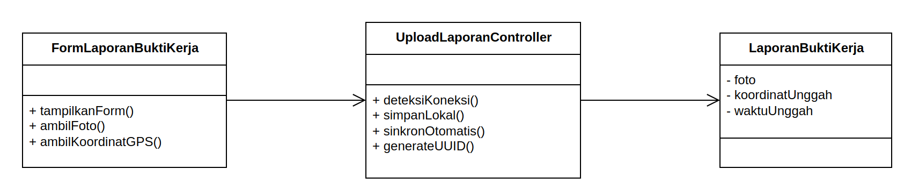
</p>
<p align="center">
<i>Gambar 8. Diagram Kelas Use Case UC05</i>
</p>

| ID Kelas | Nama Kelas | Atribut | Metode/Operasi |
| :--- | :--- | :--- | :--- |
| C14 | `FormLaporanBuktiKerja` | - | `tampilkanForm()`, `ambilFoto()`, `ambilKoordinatGPS()`, `tampilkanPeringatanGPS()` |
| C15 | `UploadLaporanController` | - | `generateUUID()`, `kompresFoto()`, `deteksiKoneksi()`, `simpanLokal()`, `sinkronOtomatis()` |
| C11 | `LaporanBuktiKerja` | `idLaporan`, `foto`, `koordinatUnggah`, `waktuUnggah`, `jarakKeTugas`, `status`, `alasanPenolakan`, `waktuVerifikasi` | `getStatus()`, `isTerkunci()` |
| C07 | `JadwalPekerjaan` | `idJadwal`, `jenisPekerjaan`, `status`, `tanggal`, `alasanPembatalan` | `perbaruiStatus()`, `batalkan()` |

Relasi: `LaporanBuktiKerja` **asosiasi** ke `JadwalPekerjaan` (0..* ke 1, bukti untuk). `UploadLaporanController` juga mengubah status tugas menjadi "menunggu verifikasi" saat laporan diterima.

### 5.2.6 Use Case UC06

**Nama Use Case:** *Menandai Titik Panas sebagai Deteksi Keliru*

<p align="center">
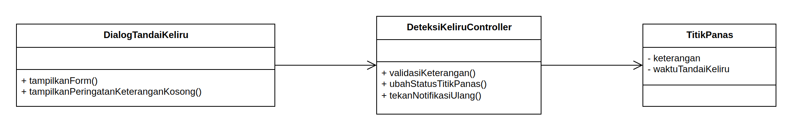
</p>
<p align="center">
<i>Gambar 9. Diagram Kelas Use Case UC06</i>
</p>

| ID Kelas | Nama Kelas | Atribut | Metode/Operasi |
| :--- | :--- | :--- | :--- |
| C16 | `DialogTandaiKeliru` | - | `tampilkanForm()`, `tampilkanPeringatanKeteranganKosong()` |
| C17 | `DeteksiKeliruController` | - | `validasiKeterangan()`, `ubahStatusTitikPanas()` |
| C04 | `TitikPanas` | `idTitikPanas`, `koordinat`, `waktuDeteksi`, `statusValiditas`, `keterangan`, `waktuTandaiKeliru` | `getStatus()`, `tandaiKeliru()`, `isDikecualikan()` |

### 5.2.7 Use Case UC07

**Nama Use Case:** *Menerima Peringatan Dini via SMS*

<p align="center">
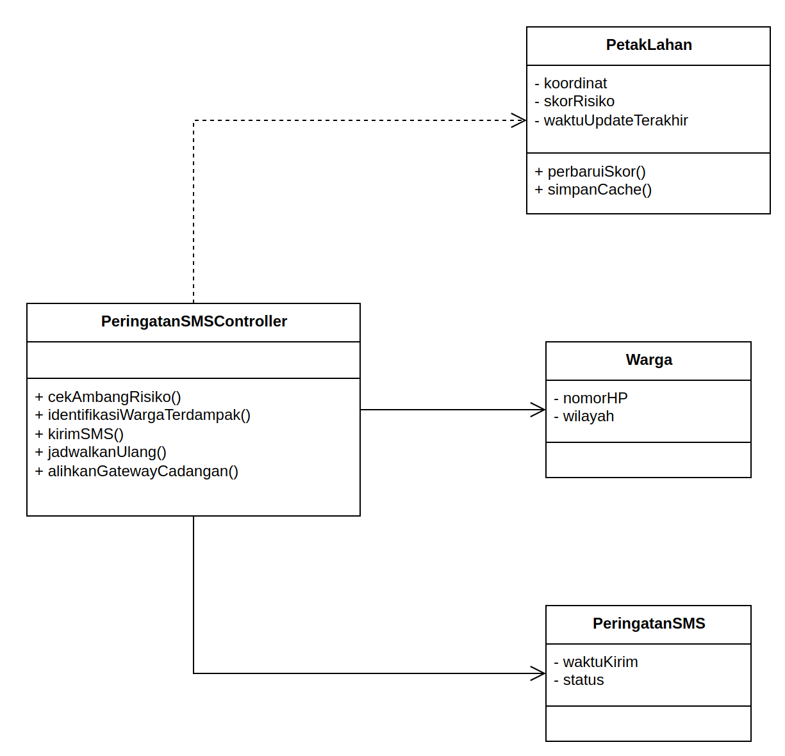
</p>
<p align="center">
<i>Gambar 10. Diagram Kelas Use Case UC07</i>
</p>

| ID Kelas | Nama Kelas | Atribut | Metode/Operasi |
| :--- | :--- | :--- | :--- |
| C18 | `PeringatanSMSController` | - | `cekAmbangRisiko()`, `cekPeringatanTerakhir()`, `identifikasiWargaTerdampak()`, `kirimSMS()`, `prosesBalasanSTOP()`, `hapusNomorDicabut()` |
| C19 | `Warga` | `idWarga`, `nomorHP`, `statusPersetujuan`, `waktuDicabut` | `cabutPersetujuan()` |
| C20 | `PeringatanSMS` | `idPeringatan`, `isiPesan`, `waktuKirim`, `status` | - |
| C03 | `PetakLahan` | `idPetak`, `batasWilayah`, `skorRisiko`, `tingkatRisiko`, `waktuUpdateTerakhir` | `perbaruiSkor()`, `simpanCache()`, `getTingkatRisiko()` |

Relasi: `PeringatanSMSController` bergantung (**dependency**) pada `PetakLahan` karena hanya membaca tingkat risiko. `Warga` **asosiasi** ke `PetakLahan` (0..* ke 1, tinggal di). `PeringatanSMS` **asosiasi** ke `Warga` (0..* ke 1, dikirim ke) dan ke `PetakLahan` (0..* ke 1, dipicu oleh). Relasi terakhir dipakai untuk mengecek apakah petak sudah dikirimi peringatan dalam 24 jam terakhir.

### 5.2.8 Use Case UC08

**Nama Use Case:** *Masuk ke Sistem*

<p align="center">
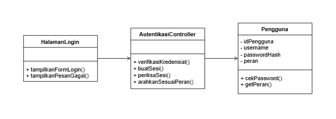
</p>
<p align="center">
<i>Gambar 11. Diagram Kelas Use Case UC08</i>
</p>

| ID Kelas | Nama Kelas | Atribut | Metode/Operasi |
| :--- | :--- | :--- | :--- |
| C21 | `HalamanLogin` | - | `tampilkanFormLogin()`, `tampilkanPesanGagal()` |
| C22 | `AutentikasiController` | - | `verifikasiKredensial()`, `buatSesi()`, `periksaSesi()`, `arahkanSesuaiPeran()` |
| C23 | `Pengguna` | `idPengguna`, `username`, `passwordHash`, `peran` | `cekPassword()`, `getPeran()` |

## 5.3 Diagram Kelas Keseluruhan

<p align="center">
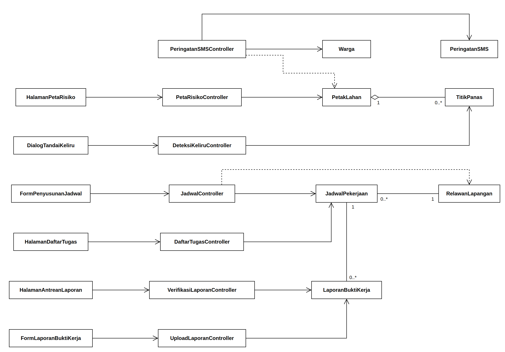
</p>
<p align="center">
<i>Gambar 12. Diagram Kelas Keseluruhan SIGAP</i>
</p>

| ID Kelas | Nama Kelas | Atribut | Metode/Operasi |
| :--- | :--- | :--- | :--- |
| C01 | `HalamanPetaRisiko` | - | `tampilkanPeta()`, `tampilkanKeteranganCache()`, `tampilkanAtribusi()` |
| C02 | `PetaRisikoController` | - | `ambilDataTitikPanas()`, `ambilDataCuaca()`, `hitungSkorRisiko()`, `ambilDataCache()`, `picuCekAmbang()` |
| C03 | `PetakLahan` | `idPetak`, `batasWilayah`, `skorRisiko`, `tingkatRisiko`, `waktuUpdateTerakhir` | `perbaruiSkor()`, `simpanCache()`, `getTingkatRisiko()` |
| C04 | `TitikPanas` | `idTitikPanas`, `koordinat`, `waktuDeteksi`, `statusValiditas`, `keterangan`, `waktuTandaiKeliru` | `getStatus()`, `tandaiKeliru()`, `isDikecualikan()` |
| C05 | `FormPenyusunanJadwal` | - | `tampilkanForm()`, `tampilkanRekomendasi()`, `tampilkanDaftarRelawanAktif()`, `tampilkanPesanKapasitasPenuh()` |
| C06 | `JadwalController` | - | `buatRekomendasi()`, `validasiKapasitas()`, `buatJadwal()`, `kirimNotifikasiTugas()` |
| C07 | `JadwalPekerjaan` | `idJadwal`, `jenisPekerjaan`, `status`, `tanggal`, `alasanPembatalan` | `perbaruiStatus()`, `batalkan()` |
| C08 | `RelawanLapangan` | `idRelawan`, `nama`, `kontak`, `statusAktif` | `getStatusAktif()`, `hitungTugasAktif()` |
| C09 | `HalamanAntreanLaporan` | - | `tampilkanAntrean()`, `tampilkanDetailLaporan()`, `tampilkanPeringatanJarak()`, `tampilkanAntreanKosong()` |
| C10 | `VerifikasiLaporanController` | - | `hitungJarak()`, `verifikasiLaporan()`, `tolakLaporan()`, `kunciLaporan()`, `perbaruiStatusTugas()` |
| C11 | `LaporanBuktiKerja` | `idLaporan`, `foto`, `koordinatUnggah`, `waktuUnggah`, `jarakKeTugas`, `status`, `alasanPenolakan`, `waktuVerifikasi` | `getStatus()`, `isTerkunci()` |
| C12 | `HalamanDaftarTugas` | - | `tampilkanDaftarTugas()`, `tampilkanDetailTugas()`, `tampilkanPenandaLuring()`, `tampilkanFormPembatalan()`, `tampilkanNotifikasi()` |
| C13 | `DaftarTugasController` | - | `ambilTugasRelawan()`, `urutkanBerdasarkanSkorRisiko()`, `simpanSalinanLokal()`, `batalkanTugasTidakAman()` |
| C14 | `FormLaporanBuktiKerja` | - | `tampilkanForm()`, `ambilFoto()`, `ambilKoordinatGPS()`, `tampilkanPeringatanGPS()` |
| C15 | `UploadLaporanController` | - | `generateUUID()`, `kompresFoto()`, `deteksiKoneksi()`, `simpanLokal()`, `sinkronOtomatis()` |
| C16 | `DialogTandaiKeliru` | - | `tampilkanForm()`, `tampilkanPeringatanKeteranganKosong()` |
| C17 | `DeteksiKeliruController` | - | `validasiKeterangan()`, `ubahStatusTitikPanas()` |
| C18 | `PeringatanSMSController` | - | `cekAmbangRisiko()`, `cekPeringatanTerakhir()`, `identifikasiWargaTerdampak()`, `kirimSMS()`, `prosesBalasanSTOP()`, `hapusNomorDicabut()` |
| C19 | `Warga` | `idWarga`, `nomorHP`, `statusPersetujuan`, `waktuDicabut` | `cabutPersetujuan()` |
| C20 | `PeringatanSMS` | `idPeringatan`, `isiPesan`, `waktuKirim`, `status` | - |
| C21 | `HalamanLogin` | - | `tampilkanFormLogin()`, `tampilkanPesanGagal()` |
| C22 | `AutentikasiController` | - | `verifikasiKredensial()`, `buatSesi()`, `periksaSesi()`, `arahkanSesuaiPeran()` |
| C23 | `Pengguna` | `idPengguna`, `username`, `passwordHash`, `peran` | `cekPassword()`, `getPeran()` |
| C24 | `Notifikasi` | `idNotifikasi`, `isiPesan`, `waktuDibuat`, `sudahDibaca` | `tandaiDibaca()` |

Relasi antar-*entity* pada diagram keseluruhan:

| Relasi | Jenis | Multiplisitas | Keterangan |
| :--- | :--- | :--- | :--- |
| `PetakLahan` ke `TitikPanas` | agregasi | 1 ke 0..* | - |
| `JadwalPekerjaan` ke `RelawanLapangan` | asosiasi | 0..* ke 1 | ditugaskan ke |
| `JadwalPekerjaan` ke `PetakLahan` | asosiasi | 0..* ke 1 | berlokasi di |
| `JadwalPekerjaan` ke `TitikPanas` | asosiasi | 0..* ke 0..1 | memeriksa (hanya untuk tugas pengecekan titik panas) |
| `LaporanBuktiKerja` ke `JadwalPekerjaan` | asosiasi | 0..* ke 1 | bukti untuk |
| `LaporanBuktiKerja` ke `Pengguna` | asosiasi | 0..* ke 0..1 | diverifikasi oleh |
| `RelawanLapangan` ke `Pengguna` | asosiasi | 1 ke 1 | memiliki akun |
| `Warga` ke `PetakLahan` | asosiasi | 0..* ke 1 | tinggal di |
| `PeringatanSMS` ke `Warga` | asosiasi | 0..* ke 1 | dikirim ke |
| `PeringatanSMS` ke `PetakLahan` | asosiasi | 0..* ke 1 | dipicu oleh |
| `Notifikasi` ke `Pengguna` | asosiasi | 0..* ke 1 | ditujukan ke |

---

# BAB 6: Traceability

| ID Kelas | ID Use Case | ID KF |
| :--- | :--- | :--- |
| C01 | UC01 | KF01, KF04, KF23 |
| C02 | UC01 | KF01, KF02, KF03, KF04, KF15, KF16 |
| C03 | UC01, UC02, UC04, UC07 | KF01, KF02, KF04, KF09, KF11, KF16, KF17 |
| C04 | UC01, UC06 | KF02, KF14, KF15 |
| C05 | UC02 | KF05, KF06, KF17 |
| C06 | UC02 | KF05, KF06, KF07, KF17 |
| C07 | UC02, UC03, UC04, UC05 | KF05, KF06, KF07, KF09, KF11, KF17, KF21, KF24 |
| C08 | UC02 | KF05, KF06 |
| C09 | UC03 | KF08, KF09 |
| C10 | UC03 | KF08, KF09, KF10, KF24 |
| C11 | UC03, UC05 | KF08, KF09, KF10, KF12, KF13, KF24 |
| C12 | UC04 | KF11, KF20, KF21 |
| C13 | UC04 | KF11, KF20, KF21 |
| C14 | UC05 | KF12 |
| C15 | UC05 | KF12, KF13 |
| C16 | UC06 | KF14 |
| C17 | UC06 | KF14, KF15 |
| C18 | UC07 | KF16, KF22 |
| C19 | UC07 | KF16, KF22 |
| C20 | UC07 | KF16 |
| C21 | UC08 | KF18, KF19 |
| C22 | UC08 | KF18, KF19, KF20 |
| C23 | UC03, UC08 | KF10, KF18, KF19 |
| C24 | UC02, UC03, UC04 | KF07, KF21, KF24 |

---

# Referensi
- NASA FIRMS Area API: https://firms.modaps.eosdis.nasa.gov/api/area/
- Open-Meteo Weather Forecast API: https://open-meteo.com/en/docs
- Open-Meteo Licence: https://open-meteo.com/en/licence
- MDN, Storage quotas and eviction criteria: https://developer.mozilla.org/en-US/docs/Web/API/Storage_API/Storage_quotas_and_eviction_criteria
- Mavin, A. EARS (Easy Approach to Requirements Syntax): https://alistairmavin.com/ears/
- Undang-Undang Republik Indonesia Nomor 27 Tahun 2022 tentang Pelindungan Data Pribadi
- Peraturan Pemerintah Republik Indonesia Nomor 71 Tahun 2014 tentang Perlindungan dan Pengelolaan Ekosistem Gambut
- Diagram UML: [https://www.drawio.com/](https://www.drawio.com/), [https://plantuml.com/](https://plantuml.com/)
